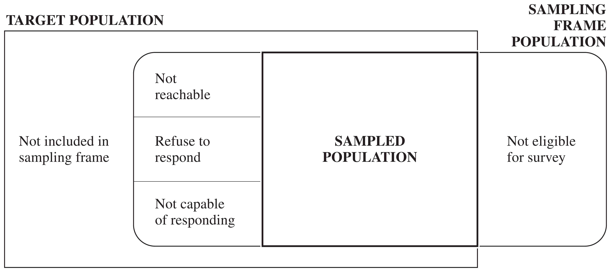

```{r setup}
#| include: false
knitr::opts_chunk$set(
  echo = FALSE,
  fig.align = "center"
)

# draw a simple checkmark (avoids relying on a unicode glyph being in the font)
draw_check <- function(cx, cy, size = 0.3, col = "red", lwd = 3) {
  lines(c(cx - size, cx - size * 0.3, cx + size),
        c(cy, cy - size * 0.6, cy + size * 0.9),
        col = col, lwd = lwd, lend = 1)
}
```

# A Bad Sampling Example

Shere Hite's book *Women and Love: A Cultural Revolution in Progress* (1987) had a
number of widely quoted results:

- 84% of women are "not satisfied emotionally with their relationships" (p. 804).
- 70% of all women "married five or more years are having sex outside of their marriages" (p. 856).
- 95% of women "report forms of emotional and psychological harassment from men with whom they are in love relationships" (p. 810).
- 84% of women report forms of condescension from the men in their love relationships (p. 809).

The book was widely criticized in newspaper and magazine articles throughout the
United States. The *Time* magazine cover story "Back Off, Buddy" (October 12, 1987)
called the conclusions of Hite's study "dubious" and "of limited value."

## A Bad Sampling Example (cont'd)

- The sample was **self-selected**—recipients of questionnaires decided whether they
  would be in the sample or not. Hite mailed 100,000 questionnaires; only 4.5% were
  returned.
- Questionnaires were mailed to organizations such as professional women's groups,
  counseling centers, church societies, and senior citizens' centers—groups whose
  viewpoints may differ from other women in the United States.
- The survey has 127 essay questions, most with several parts. Who will tend to
  return such a survey?
- Many questions are vague (e.g., "love"), making percentages hard to interpret.
- Many questions are leading, suggesting to the respondent which response to give.

## Type of Probability Sampling

A **simple random sample (SRS)** is the simplest form of probability sample. An SRS
of size $n$ is taken when every possible subset of $n$ units in the population has
the same chance of being the sample.

```{r}
#| label: fig-srs
#| fig-width: 6
#| fig-height: 3
#| out-width: "55%"
set.seed(42)
n <- 25L
k <- 5L
x <- runif(n, 0.5, 9.5)
y <- runif(n, 0.5, 4.5)
sel <- sample(n, k)

par(mar = c(0.2, 0.2, 0.2, 0.2))
plot(NA, xlim = c(0, 10), ylim = c(0, 5), asp = 1,
     xaxt = "n", yaxt = "n", xlab = "", ylab = "", bty = "o")
points(x, y, pch = 19, col = "firebrick", cex = 1.3)
points(x[sel], y[sel], pch = 21, col = "blue", lwd = 2, cex = 3)
```

## Stratified Random Sampling

In a **stratified random sample**, the population is divided into subgroups called
**strata**. An SRS is selected independently from each stratum. Strata are often
subgroups of interest—regions of a country, terrain types, or firm sizes.
Stratification often increases precision because elements within a stratum tend to
be more similar than randomly selected elements from the whole population.

```{r}
#| label: fig-stratified
#| fig-width: 7.5
#| fig-height: 4.4
#| out-width: "60%"
set.seed(5)

strata <- list(
  list(name = "ON", xmin = 0, xmax = 3,  ymin = 3.5, ymax = 7,   n = 6, k = 2),
  list(name = "BC", xmin = 3, xmax = 6,  ymin = 3.5, ymax = 7,   n = 6, k = 1),
  list(name = "AB", xmin = 6, xmax = 9,  ymin = 3.5, ymax = 7,   n = 6, k = 2),
  list(name = "SK", xmin = 9, xmax = 12, ymin = 3.5, ymax = 7,   n = 5, k = 1),
  list(name = "QC", xmin = 0, xmax = 4,  ymin = 0,   ymax = 3.5, n = 7, k = 2),
  list(name = "MB", xmin = 4, xmax = 8,  ymin = 0,   ymax = 3.5, n = 6, k = 2),
  list(name = "NB", xmin = 8, xmax = 12, ymin = 0,   ymax = 3.5, n = 5, k = 1)
)

par(mar = c(0.2, 0.2, 0.2, 0.2))
plot(NA, xlim = c(0, 12), ylim = c(0, 7), asp = 1,
     xaxt = "n", yaxt = "n", xlab = "", ylab = "", bty = "o")

for (s in strata) {
  rect(s$xmin, s$ymin, s$xmax, s$ymax, border = "blue4", lwd = 1.5)
  text((s$xmin + s$xmax) / 2, s$ymax - 0.5, s$name,
       col = "blue4", font = 2, cex = 1.6)

  px <- runif(s$n, s$xmin + 0.4, s$xmax - 0.4)
  py <- runif(s$n, s$ymin + 0.4, s$ymax - 1.0)
  points(px, py, pch = 19, col = "blue4", cex = 1.1)

  sel <- sample(s$n, s$k)
  points(px[sel], py[sel], pch = 21, col = "firebrick", lwd = 2, cex = 2.6)
}
```

## Cluster Sampling

In a **cluster sample**, observation units are aggregated into larger sampling
units called **clusters**.

Example: to survey Lutheran church members in Minneapolis without a list of all
members, take an SRS of churches (clusters), then subsample members within each
selected church (observation units). This is convenient, but members of the same
church may be more similar to each other than a random sample of Lutherans, so a
cluster sample may provide less information than an SRS of the same size.

```{r}
#| label: fig-cluster
#| fig-width: 9
#| fig-height: 5
#| out-width: "85%"
set.seed(3)

clusters <- list(
  list(xmin = 0,    xmax = 2,    ymin = 0,    ymax = 4.2, n = 7, k = 3, selected = TRUE),
  list(xmin = 3.2,  xmax = 4.7,  ymin = 0.5,  ymax = 3.6, n = 4, k = 0, selected = FALSE),
  list(xmin = 6.2,  xmax = 7.9,  ymin = -0.6, ymax = 5.2, n = 6, k = 3, selected = TRUE),
  list(xmin = 11.2, xmax = 12.7, ymin = 0.7,  ymax = 3.7, n = 4, k = 2, selected = TRUE)
)

par(mar = c(2, 0.2, 0.2, 0.2))
plot(NA, xlim = c(-0.3, 13), ylim = c(-2, 5.5), asp = 1,
     xaxt = "n", yaxt = "n", xlab = "", ylab = "", bty = "n")

for (cl in clusters) {
  rect(cl$xmin, cl$ymin, cl$xmax, cl$ymax, border = "blue4", lwd = 1.5)

  px <- runif(cl$n, cl$xmin + 0.25, cl$xmax - 0.25)
  py <- runif(cl$n, cl$ymin + 0.3, cl$ymax - 0.3)
  points(px, py, pch = 19, col = "blue4", cex = 1.1)

  if (cl$k > 0) {
    sel <- sample(cl$n, cl$k)
    points(px[sel], py[sel], pch = 21, col = "darkorange3", lwd = 2, cex = 2.4)
  }
  if (cl$selected) {
    draw_check((cl$xmin + cl$xmax) / 2, cl$ymin - 0.8, size = 0.3)
  }
}

# ellipsis indicating more (unselected) clusters
segments(8.6, 2.3, 10.6, 2.3, lty = 2, lwd = 1.5, col = "blue4")
```

# Elements of Sampling Problems

Reading suggestions:

- Lohr, Ch 1
- Scheaffer et al., Ch 2

## Basic Definitions

**Observation unit** An object on which a measurement is taken; also called an
**element**. In human population studies, observation units are often individuals.

**Target population** The complete collection of observations we want to study.
Defining the target population is often difficult—for example, should a political
poll target all eligible adults, all registered voters, or all who voted last
election?

**Sample** A subset of a population.

## Basic Definitions (cont'd)

**Sampled population** The collection of all possible observation units that might
have been chosen in a sample—the population from which the sample was actually
taken.

**Sampling unit** A unit that can be selected for a sample. We may want to study
individuals but lack a list of them; instead, households serve as sampling units
while individuals remain the observation units.

**Sampling frame** A list, map, or other specification of sampling units in the
population from which a sample may be selected (e.g., a list of telephone numbers,
street addresses, or farms).

## Target vs. Sampled Population

In an ideal survey, the sampled population equals the target population, but this
ideal is rarely met. Not all persons in the target population are in the sampling
frame, and some in the frame are not reachable, refuse to respond, or are not
capable of responding.

{fig-align="center" width="90%"}

In the Hite (1987) study: the element was an individual woman, the target
population was all adult U.S. women, but the sampled population was women
belonging to women's organizations who would return the questionnaire.

# Selection Bias

**Selection bias** occurs when part of the target population is not in the sampled
population, or more generally, when population units are sampled at a different
rate than intended.

A **sample of convenience** is often biased, since units that are easiest to select
or most likely to respond are usually not representative of harder-to-select or
nonresponding units.

## Selection Bias: Examples

- A convenience sample of adolescents used to study communication about AIDS likely
  overestimated parent-teen communication, since adolescents willing to talk to
  investigators are also more likely to talk to other authority figures.
- **Misspecifying the target population**: 1994 Arizona gubernatorial primary polls
  predicted Eddie Basha would trail by 9+ points; he won 37% of the vote. The polls
  targeted past primary voters, missing new rural voters who supported Basha.

## Selection Bias: Coverage Problems

**Undercoverage** — failing to include all of the target population in the sampling
frame. The U.S. Behavioral Risk Factor Surveillance System survey (telephone-based)
misses households without phones, and historically missed cell-only households;
coverage varies by region and income.

**Overcoverage** — including units in the sampling frame that are not in the target
population, e.g., interviewers including under-18 respondents in an adults-only
radio survey.

## Selection Bias: Nonresponse

Failing to obtain responses from all of the chosen sample. **Nonresponse** distorts
survey results even when other sources of selection bias are minimized.

Nonrespondents often differ critically from respondents, but the extent of that
difference is usually unknown. Some published surveys have response rates as low
as 10%—it is difficult to generalize results when 90% of the sample cannot be
reached or refuses to participate.

# Measurement Error

When a response differs from the true value, **measurement error** has occurred.
**Measurement bias** occurs when responses tend to differ from the truth in one
direction. Like selection bias, it must be considered and minimized at the design
stage.

## Measurement Error: Examples

- **People don't tell the truth.** Farmers receiving food aid may underreport crop
  yields, hoping for more aid.
- **People don't understand questions.** A 1993 Roper poll found 25% of Americans
  didn't believe the Holocaust happened; after removing the confusing
  double-negative wording, only 1% agreed it was "possible" the Holocaust never
  happened.
- **People forget.** In the NCVS, respondents asked about crime victimization in
  the last six months sometimes include events from further back—called
  **telescoping**.

## Questionnaire Design

- **Always test your questions** before taking the survey.
- **Keep it simple and clear.** Belson (1981) tested "What *proportion* of your
  evening viewing time do you spend watching news programmes?" on 53 people—only
  14 correctly interpreted "proportion" as percentage/part/fraction.
- **Use specific questions instead of general ones.** Instead of "Did anyone attack
  you in the last six months," the NCVS asks a detailed series: "With any weapon,
  for instance a gun or knife," "With anything like a baseball bat, frying pan,
  scissors, or stick...."

# Sampling and Nonsampling Errors

**Sampling error** results from taking one sample instead of examining the whole
population—the basis for a poll's margin of error. A different sample would likely
give a different result; sampling errors are reported in probabilistic terms.

**Nonsampling errors** (selection bias, measurement error) cannot be attributed to
sample-to-sample variability. They are often far larger than the reported sampling
error—a survey may proudly report a 3% margin of error from a 30% response rate,
while ignoring tremendous selection bias.

## Why Sample at All?

- Sampling provides reliable information at far less cost than a census, and with
  probability samples you can quantify the sampling error. Some measurements are
  destructive (e.g., pulverizing a cookie to measure fat content), so a census is
  not even possible.
- Data can be collected more quickly, allowing timely estimates (an unemployment
  rate for 2005 published in 2015 is useless).
- Sample-based estimates can be **more accurate** than a census, since a smaller
  operation allows investigators to be more careful; a full census requires a
  large administrative effort involving many data collectors.
