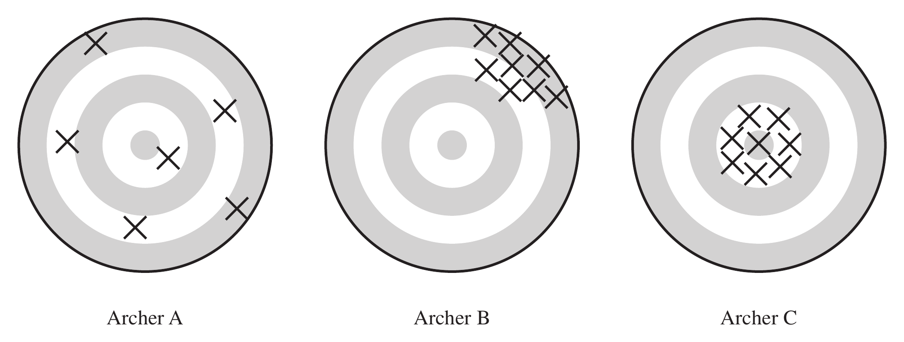

```{r setup}
#| include: false
knitr::opts_chunk$set(
  echo = FALSE,
  fig.align = "center"
)
```

# Framework for Probability Sampling

Reading suggestions:

- Lohr, 2.2 (more concise)
- Scheaffer et al., 3.1--3.4

Concepts: Population, Sample, Sampling Probability, Inclusion Probability, Bias,
Variance, MSE

## The Population and Its Samples

The finite **population**, or **universe**, of $N$ units is denoted by the index set
$$\mathcal{U} = \{1, 2, \ldots, N\}.$$

Out of this population we can choose various **samples**, which are subsets of
$\mathcal{U}$. The particular sample chosen is denoted $\mathcal{S}$, a subset
consisting of $n$ of the units in $\mathcal{U}$.

**Example:** suppose $\mathcal{U} = \{1,2,3,4\}$ ($N=4$). Six different samples of
size $n=2$ could be chosen:
$$
\mathcal{S}_1=\{1,2\}\quad \mathcal{S}_2=\{1,3\}\quad \mathcal{S}_3=\{1,4\}\quad
\mathcal{S}_4=\{2,3\}\quad \mathcal{S}_5=\{2,4\}\quad \mathcal{S}_6=\{3,4\}
$$

## Probability Sampling

In probability sampling, each possible sample $\mathcal{S}$ from the population has
a known probability $P(\mathcal{S})$ of being chosen, and the probabilities of the
possible samples sum to 1.

One possible design for a probability sample of size 2 from $\mathcal{U}=\{1,2,3,4\}$:
$$
P(\mathcal{S}_1)=\tfrac13,\quad P(\mathcal{S}_4)=\tfrac16,\quad P(\mathcal{S}_6)=\tfrac12,
\quad P(\mathcal{S}_2)=P(\mathcal{S}_3)=P(\mathcal{S}_5)=0
$$

These probabilities are known **before** the sample is drawn. One way to realize
this design: place six labeled balls in a box — two labeled 1, one labeled 4, and
three labeled 6 — then draw one ball at random; whichever label is drawn gives the
sample $\mathcal{S}_i$.

## Notation for the Values $y_i$

Let $y_i$ be a characteristic associated with the $i$th unit in the population. We
treat $y_i$ as a **fixed** quantity: if farm 723 is in the sample, the corn yield
$y_{723}$ is known exactly.

| $i$   | 1     | 2     | 3     | $\cdots$ | $N$   |
|:-----:|:-----:|:-----:|:-----:|:--------:|:-----:|
| $y_i$ | $y_1$ | $y_2$ | $y_3$ | $\cdots$ | $y_N$ |

::: {.callout-note}
$y_i$ is **not** a random variable in Lohr's book. In Scheaffer's book, $y_i$ is
used for the population *value* and $Y_i$ is a random variable.
:::

## Inclusion Probability and Sampling Weight

Once we have chosen a sample design, each unit in the population has a known
probability of appearing in the selected sample:
$$
\pi_i = P(\text{unit } i \text{ in sample})
$${#eq-include}
computed by summing the probabilities of all possible samples that contain unit
$i$. In probability sampling, all $\pi_i$ are known before the survey commences,
and we assume $\pi_i > 0$ for every unit in the population.

**Sampling weight:** $w_i = 1/\pi_i$. This notation matters because for many
sampling schemes, the population total estimator can be written as
$$
\hat t = \sum_{i \in \mathcal{S}} w_i \, y_i = \sum_{i \in \mathcal{S}} \frac{y_i}{\pi_i}.
$$

## Example: Inclusion Probabilities

For $\mathcal{U}=\{1,2,3,4\}$, $N=4$, $n=2$, with the sample design above:

| $\mathcal{S}_i$ | $\{1,2\}$ | $\{2,3\}$ | $\{1,3\}$ | $\{2,4\}$ | $\{1,4\}$ | $\{3,4\}$ |
|:---:|:---:|:---:|:---:|:---:|:---:|:---:|
| $P(\mathcal{S}_i)$ | $1/3$ | $1/6$ | $0$ | $0$ | $0$ | $1/2$ |

Unit $i$ is in the sample whenever one of the sets containing it is drawn.

## Example: Inclusion Probabilities (cont'd)

$$
\pi_1 = P(\{1,2\}) = \tfrac13
$$
$$
\pi_2 = P(\{1,2\})+P(\{2,3\}) = \tfrac13+\tfrac16=\tfrac12
$$
$$
\pi_3 = P(\{2,3\})+P(\{3,4\}) = \tfrac16+\tfrac12=\tfrac46
$$
$$
\pi_4 = P(\{3,4\}) = \tfrac12
$$

Note $\sum_{i=1}^4 \pi_i \ne 1$ (it equals 2, since $n=2$ units are drawn each time).

# Population Quantities

## Total, Mean, Variance

$$
\textbf{Total:}\quad t = \sum_{i=1}^N y_i
\qquad
\textbf{Mean:}\quad \bar y_{\mathcal{U}} = \frac{t}{N} = \frac{\sum_{i=1}^N y_i}{N}
$$

$$
\textbf{Variance:}\quad S^2 = \frac{1}{N-1}\sum_{i=1}^N (y_i-\bar y_{\mathcal{U}})^2
\qquad
\textbf{Standard deviation:}\quad S = \sqrt{S^2}
$$

::: {.callout-note}
In Scheaffer's book, $\displaystyle \sigma^2 = \frac1N \sum_{i=1}^N (y_i - \bar y_{\mathcal{U}})^2$
(divides by $N$, not $N-1$).
:::

## Example: A Population Proportion

| $i$   | 1 | 2 | 3 | 4 | 5 |
|:---:|:---:|:---:|:---:|:---:|:---:|
| $y_i$ | 1 | 0 | 0 | 0 | 1 |

$$
t = \sum_{i=1}^5 y_i = 1+0+0+0+1 = 2
\qquad
\bar y_{\mathcal{U}} = \frac{2}{5} = 40\% \ \text{(population proportion)}
$$
$$
S^2 = \frac{1}{5-1}\Big((1-0.4)^2\times 2 + (0-0.4)^2\times 3\Big) = 0.3
$$

::: {.callout-note}
For a 0/1 population, $S^2 \to p(1-p) = 0.4\times0.6$ as $N$ becomes large.
:::

## Example: Number of Devices per Household

| $i$   | 1 | 2 | 3 | 4 |
|:---:|:---:|:---:|:---:|:---:|
| $y_i$ | 2 | 4 | 4 | 6 |

$$
t = \sum_{i=1}^4 y_i = 2+4+4+6 = 16
\qquad
\bar y_{\mathcal{U}} = \frac{16}{4} = 4
$$
$$
S^2 = \frac{1}{4-1}\Big((2-4)^2+(4-4)^2+(4-4)^2+(6-4)^2\Big) = \frac{8}{3}
$$

## Statistic and Sampling Distribution

**Statistic**\
A statistic is a function of the observations in a sample, used for estimating a
population quantity.

**Sampling distribution**\
The sampling distribution is the distribution of a statistic under repeated
sampling.

## Example: Estimating the Total

For estimating $t = \sum_{i=1}^N y_i$, we use
$$
\hat t = \frac{\sum_{i\in\mathcal{S}} y_i}{n} \times N
$$

- $n$: sample size
- $N$: population size

**Example** (same devices-per-household population): $n=2$, $N=4$,
$$
\bar y = \frac{\sum_{i\in\mathcal S} y_i}{n}, \qquad \hat t = N\cdot\bar y = 4\bar y
$$
with true population values $\bar y_{\mathcal{U}}=4$ and population total $t=16$.

## Example: Sampling Distribution of $\bar y$

All six possible samples of size 2 from $\{y_1,\ldots,y_4\}=\{2,4,4,6\}$:

| $\mathcal S_i$ | $\{1,2\}$ | $\{1,3\}$ | $\{1,4\}$ | $\{2,3\}$ | $\{2,4\}$ | $\{3,4\}$ |
|:---:|:---:|:---:|:---:|:---:|:---:|:---:|
| $P(\mathcal S_i)$ | $1/3$ | $0$ | $0$ | $1/6$ | $0$ | $1/2$ |
| $\bar y$ | 3 | 3 | 5 | 4 | 5 | 5 |

Collecting equal values of $\bar y$ gives the **sampling distribution of $\bar y$**:

| $k$ | 3 | 4 | 5 |
|:---:|:---:|:---:|:---:|
| $P(\bar y = k)$ | $1/3$ | $1/6$ | $1/2$ |

## Plot of the Sampling Distribution

```{r}
#| label: fig-sampdist
#| fig-width: 6.5
#| fig-height: 4
#| out-width: "75%"
k <- c(3, 4, 5)
p <- c(1/3, 1/6, 1/2)
Eybar <- sum(k * p)     # E(ybar)
yU <- 4                 # population mean, ybar_U

par(mar = c(4, 4, 1, 1))
plot(NA, xlim = c(2.5, 5.5), ylim = c(0, 0.6),
     xlab = expression(bar(y)), ylab = expression(P(bar(y) == k)),
     xaxt = "n", cex.lab = 1.3)
axis(1, at = k)
segments(k, 0, k, p, lwd = 3, col = "black")
points(k, p, pch = 19, cex = 1.4)

abline(v = yU, col = "red", lwd = 2, lty = 2)
text(yU, 0.58, expression(bar(y)[U]), col = "red", pos = 2)

abline(v = Eybar, col = "blue", lwd = 2, lty = 2)
text(Eybar, 0.52, expression(E(bar(y))), col = "blue", pos = 4)
```

## Bias and MSE of $\bar y$

$$
E(\bar y) = 3\times\tfrac13 + 4\times\tfrac16 + 5\times\tfrac12 = \frac{25}{6}
$$
$$
\text{Bias}(\bar y) = E(\bar y) - \bar y_{\mathcal{U}} = \frac{25}{6} - 4 = \frac16
$$
$$
\text{MSE}(\bar y) = E\big[(\bar y - \bar y_{\mathcal{U}})^2\big]
 = (3-4)^2\cdot\tfrac13 + (4-4)^2\cdot\tfrac16 + (5-4)^2\cdot\tfrac12 = 0.833
$$

## Variance of $\bar y$

$$
V(\bar y) = E\big[(\bar y - E(\bar y))^2\big]
$$
$$
 = \Big(3-\tfrac{25}{6}\Big)^2\tfrac13 + \Big(4-\tfrac{25}{6}\Big)^2\tfrac16
   + \Big(5-\tfrac{25}{6}\Big)^2\tfrac12 = 0.8056
$$

## When an Estimator Is Unbiased

When $\hat\theta$ is unbiased ($E(\hat\theta)=\theta$),
$$
\text{MSE}(\hat\theta) = E\big[(\hat\theta-\theta)^2\big]
 = E\big[(\hat\theta - E(\hat\theta))^2\big] = V(\hat\theta)
$$

## MSE = Bias$^2$ + Variance

Mathematically, we can show that
$$
\text{MSE}(\hat\theta) = \big(\text{Bias}(\hat\theta)\big)^2 + V(\hat\theta)
$$

**Check with our example:**
$$
\text{MSE}(\bar y) = 0.833\ldots
$$
$$
\text{Bias}(\bar y)^2 + V(\bar y) = \Big(\frac16\Big)^2 + 0.8056 = 0.833\ldots \checkmark
$$

## Unbiased, Precise, and Accurate

An estimator $\hat t$ of $t$ is:

- **unbiased** if $E(\hat t) = t$
- **precise** if $V(\hat t) = E\big[(\hat t - E[\hat t])^2\big]$ is small
- **accurate** if $\text{MSE}(\hat t) = E\big[(\hat t - t)^2\big]$ is small

A badly biased estimator may be precise but will not be accurate: accuracy (MSE)
is how close the estimate is to the truth, while precision (variance) measures how
close estimates from different samples are to *each other*.

{fig-align="center" width="95%"}

## Summary

The finite population $\mathcal U$ consists of units $\{1,2,\ldots,N\}$ with
measured values $\{y_1,y_2,\ldots,y_N\}$. We select a sample $\mathcal S$ of $n$
units from $\mathcal U$ using the probabilities of selection that define the
sampling design.

The $y_i$'s are fixed but unknown quantities — unknown unless that unit happens to
appear in our sample $\mathcal S$.
