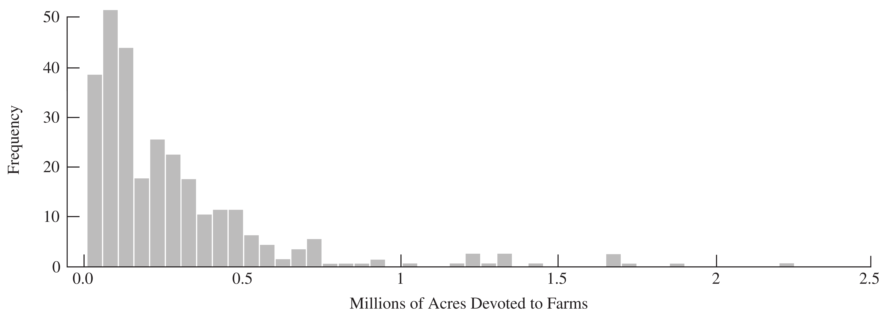

```{r setup}
#| include: false
knitr::opts_chunk$set(
  echo = FALSE,
  fig.align = "center"
)
```

# Simple Random Sampling

Textbook sections:

- Section 2.3--2.6, 2.8 in Lohr (ignoring 2.7 first)
- Section 4.1--4.5 in Scheaffer et al.

## SRSWR and SRS

A **simple random sample with replacement (SRSWR)** of size $n$ from a
population of $N$ units can be thought of as drawing $n$ independent samples of
size 1.

A **simple random sample without replacement (SRS)** of size $n$ is selected so
that every possible subset of $n$ distinct units in the population has the same
probability of being selected as the sample:
$$
P(\mathcal S) = \frac{1}{\binom{N}{n}} = \frac{n!(N-n)!}{N!}.
$$

As a consequence, the probability that unit $i$ appears in the sample is
$\pi_i = n/N$.

## How to Do SRS?

Using computer-generated random numbers:
```
sample(1:N, size = n)
```

## Inclusion Probability {#sec-inclusion}

Define the sample-membership indicator
$$
Z_i = \begin{cases} 1 & \text{if unit } i \text{ is in the sample} \\ 0 & \text{otherwise} \end{cases}
$$

If unit $i$ is in the sample, the other $n-1$ units must come from the remaining
$N-1$ units, so
$$
\pi_i = P(Z_i=1) = \frac{\text{number of samples including unit } i}{\text{number of possible samples}}
 = \frac{\binom{N-1}{n-1}}{\binom{N}{n}} = \frac{n}{N}.
$$

## Estimators for the Population Mean $\bar y_{\mathcal U}$

**Point estimate:**
$$
\bar y_{\mathcal S} = \frac1n \sum_{i \in \mathcal S} y_i
 = \frac1n \sum_{i=1}^N Z_i y_i
$$

**Sample variance** (estimates the unknown population variance $S^2$):
$$
s^2 = \frac{1}{n-1}\sum_{i\in\mathcal S} (y_i - \bar y)^2
$$

## Variance of $\bar y$ and Standard Error

An unbiased estimator of the variance of $\bar y$:
$$
\hat V(\bar y) = \Big(1-\frac nN\Big)\frac{s^2}{n}
$$

::: {.callout-note}
The factor $\big(1-\tfrac nN\big)$ is the **finite population correction (fpc)**.
:::

The **standard error (SE)** is the square root of the estimated variance:
$$
\text{SE}(\bar y) = \sqrt{\Big(1-\frac nN\Big)\frac{s^2}{n}}
$$

## Estimators for the Population Total $t$

$$
\hat t = N \bar y
$$
$$
\hat V(\hat t) = N^2\Big(1-\frac nN\Big)\frac{s^2}{n}
\qquad
\text{SE}(\hat t) = N \cdot \text{SE}(\bar y)
$$

## Expression of $\hat t$ with Sampling Weight $w_i$

$$
\pi_i = n/N \qquad w_i = 1/\pi_i = N/n
$$
$$
\sum_{i\in\mathcal S} w_i y_i = \sum_{i\in\mathcal S} \frac{N}{n} y_i = \hat t
$$

## Coefficient of Variation (CV)

The CV is a scale-free measure of variability, defined when $\bar y_{\mathcal U}\ne 0$:
$$
\text{CV}(\bar y) = \frac{\sqrt{V(\bar y)}}{E(\bar y)}
 = \sqrt{1-\frac nN}\ \frac{S}{\sqrt n\, \bar y_{\mathcal U}}
$$

Estimated from a sample (SRS):
$$
\widehat{\text{CV}}(\bar y) = \frac{\text{SE}(\bar y)}{\bar y}
 = \sqrt{1-\frac nN}\ \frac{s}{\sqrt n\, \bar y}
$$

$\text{CV}(\hat t) = \sqrt{V(\hat t)}/E(\hat t)$ is the same as $\text{CV}(\bar y)$.

## Example: Census of Agriculture

The U.S. government conducts a Census of Agriculture every five years, collecting
data on all farms (any place producing $1000+ of agricultural products) in the 50
states, for each of $N=3078$ counties/county-equivalents. The file `agpop.csv`
contains 1982, 1987, and 1992 farm data for the whole population.

An SRS of $n=300$ counties was selected with computer-generated random numbers;
this subset is saved in `agsrs.csv`.

We will estimate the mean and variance of `acres92`, the number of acres devoted
to farms in 1992.

## Example: Estimates for `acres92`

Based on `agsrs.csv`, with $N=3078$ and $n=300$:
$$
\bar y = 297{,}897 \qquad s = 344{,}551.9
$$
$$
\hat t = N\bar y = 916{,}927{,}110
$$
$$
\text{SE}(\bar y) = \sqrt{\frac{s^2}{n}\Big(1-\frac{300}{3078}\Big)} = 18{,}898.434
$$
$$
\text{SE}(\hat t) = (3078)(18{,}898.434) = 58{,}169{,}381
$$

## Example: Calculating CV

$$
\widehat{\text{CV}}(\hat t) = \widehat{\text{CV}}(\bar y)
 = \frac{\text{SE}(\bar y)}{\bar y}
 = \frac{18{,}898.434}{297{,}897} = 0.06344
$$

Since these data are highly skewed, we should also report the **median** number
of farm acres in a county, which is 196,717.

## Estimators for a Population Proportion

Estimating a proportion is a special case of estimating a mean. Define $y_i=1$ if
unit $i$ has the characteristic of interest and $y_i=0$ otherwise. Then
$$
p = \frac{1}{N}\sum_{i=1}^N y_i = \bar y_{\mathcal U}, \qquad
\hat p = \frac1n\sum_{i\in\mathcal S} y_i = \bar y
$$
so $\hat p$ is an unbiased estimator of $p$. For binary $y_i$, the population
variance simplifies to
$$
S^2 = \frac{N}{N-1}\,p(1-p).
$$

## Variance of $\hat p$

From the general SRS variance formula,
$$
V(\hat p) = \Big(\frac{N-n}{N-1}\Big)\frac{p(1-p)}{n}
$$

The sample variance also simplifies:
$$
s^2 = \frac{1}{n-1}\sum_{i\in\mathcal S}(y_i-\hat p)^2 = \frac{n}{n-1}\,\hat p(1-\hat p)
$$

giving the estimated variance
$$
\hat V(\hat p) = \Big(1-\frac nN\Big)\frac{\hat p (1-\hat p)}{n-1}
$$

## Example: Proportion of Counties with Fewer than 200,000 Acres

For the sample described above, the estimated proportion of counties with fewer
than 200,000 acres in farms is
$$
\hat p = \frac{153}{300} = 0.51
$$
with standard error
$$
\text{SE}(\hat p) = \sqrt{\Big(1-\frac{300}{3078}\Big)\frac{(0.51)(0.49)}{299}} = 0.0275
$$

## Confidence Intervals

In statistics, confidence intervals (CIs) are used to indicate the accuracy of an
estimate.

A 95% confidence interval is often explained heuristically: if we take samples
from our population over and over again, and construct a CI using our procedure
for each possible sample, we expect 95% of the resulting intervals to include the
true value of the population parameter.

## Normality of the Sample Mean

Hájek's theorem: if certain technical conditions hold and $n$, $N$, and $N-n$ are
all "sufficiently large," then the sampling distribution of
$$
\frac{\bar y - \bar y_{\mathcal U}}{\text{SE}(\bar y)}
 = \frac{\bar y - \bar y_{\mathcal U}}{\sqrt{\big(1-\tfrac nN\big)}\, \tfrac{S}{\sqrt n}}
$$
is approximately standard normal. This is the basis for constructing confidence
intervals for SRS estimates.

## Confidence Intervals for SRS Estimates

**Population mean:**
$$
\bar y \pm t_{\alpha/2,\, n-1} \cdot \text{SE}(\bar y)
$$

**Population total:**
$$
\hat t \pm t_{\alpha/2,\, n-1} \cdot \text{SE}(\hat t) = N\bar y \pm t_{\alpha/2,\,n-1}\cdot N\cdot \text{SE}(\bar y)
$$

**Population proportion:**
$$
\hat p \pm t_{\alpha/2,\, n-1} \cdot \text{SE}(\hat p)
$$

## Example: CIs for `agsrs.csv`

Using $t_{\alpha/2,299} = 1.968$:

A 95% CI for $\bar y_{\mathcal U}$ (mean acreage):
$$
[297{,}897 \pm (1.968)(18{,}898.434)] = [260{,}706,\ 335{,}088]
$$

A 95% CI for the population total $t$:
$$
[916{,}927{,}110 \pm 1.968(58{,}169{,}381)] = [8.02\times10^8,\ 1.03\times10^9]
$$

A 95% CI for the proportion of counties with fewer than 200,000 acres:
$$
0.51 \pm 1.968(0.0275) = [0.456,\ 0.564]
$$

## Example: Skewness of Acreage Data

```{r}
#| label: fig-acreage-histogram
#| fig-cap: "Histogram: number of acres devoted to farms in 1992, for an SRS of 300 counties. Note the skewness of the data. Most of the counties have fewer than 500,000 acres in farms; some counties, however, have more than 1.5 million acres in farms."
#| out-width: "85%"

```

## Minimum Sample Size for Normality to Hold

Sugden et al. (2000) extend Cochran's rule for the sample size needed for the
normal approximation to be adequate. A recommended minimum:
$$
n_{\min} = 28 + 25\left(\frac{\sum_{i=1}^N (y_i-\bar y_{\mathcal U})^3}{N S^3}\right)^{\!2}
$$

The quantity in parentheses is the **skewness** of the population; larger
skewness requires a larger sample for normality to hold.

## Example: Checking the Minimum Sample Size

Substituting sample values $s=344{,}551.9$ and
$\sum_{i\in\mathcal S}(y_i-\bar y)^3/n = 1.05036\times10^{17}$ for the
corresponding population quantities:
$$
n_{\min} = 28 + 25\left(\frac{1.05036\times10^{17}}{(344{,}551.9)^3}\right)^{\!2} \approx 193
$$

Our sample of size $n=300$ exceeds $n_{\min}\approx193$, so it appears
sufficiently large for the sampling distribution of $\bar y$ to be approximately
normal.

## Sample Size Estimation: Specifying Tolerable Error

The desired precision is often expressed in absolute terms:
$$
P(|\bar y - \bar y_{\mathcal U}| \le e) = 1-\alpha
$$
where $e$ is the **margin of error**. For many surveys of people where a
proportion is measured, $e=0.03$ and $\alpha=0.05$.

Or in relative terms, controlling the CV:
$$
P\left(\left|\frac{\bar y - \bar y_{\mathcal U}}{\bar y_{\mathcal U}}\right| \le r\right) = 1-\alpha
\quad\Longrightarrow\quad e = r \cdot \bar y_{\mathcal U}
$$

For example, if $\bar y_{\mathcal U}=180$K and $r=0.1$, then $e=18$K.

## Solving for the Required Sample Size

To obtain absolute precision $e$, find $n$ satisfying
$$
e = z_{\alpha/2}\sqrt{\Big(1-\frac nN\Big)\frac{S^2}{n}}
$$

First find the sample size $n_0$ we would use for an infinite population:
$$
n_0 = \left(\frac{z_{\alpha/2} S}{e}\right)^{\!2}
$$

Then the fpc-adjusted sample size is
$$
n = \frac{n_0}{1+n_0/N} = \frac{z_{\alpha/2}^2 S^2}{e^2 + z_{\alpha/2}^2 S^2/N}
$$

## Example: Margin of Error 0.03 for a Proportion

We want to estimate the proportion of recipes in a cookbook (of $N=1251$
recipes) that don't involve animal products, using a 95% CI with margin of error
0.03:
$$
n_0 = \frac{(1.96)^2 (\tfrac12)(1-\tfrac12)}{(0.03)^2} \approx 1067
$$

Since $n_0$ is large relative to $N=1251$, we apply the fpc adjustment:
$$
n = \frac{n_0}{1+n_0/N} = \frac{1067}{1+1067/1251} = 576
$$

If $N$ were very large, we would use $n\approx n_0$ directly.

## Example: Agriculture Farming Sample Size

We took a pilot sample of size 30 (one county missing `acres92`); the sample SD
of the remaining 29 observations was 519,085. With a desired margin of error of
60,000:
$$
n_0 = (1.96)^2\,\frac{519{,}085^2}{60{,}000^2} \approx 288
$$

With $N=3078$:
$$
n = \frac{n_0}{1+n_0/N} = \frac{288}{1+288/3078} \approx 263
$$

We took a sample of size 300 in case the pilot's estimated SD was too low.

## Randomization Theory for SRS

In the **randomization theory** (design-based) approach, the $y_i$'s are
considered fixed but unknown numbers; the random variables $Z_i$ indicate which
population units are in the sample:
$$
\bar y = \sum_{i\in\mathcal S} \frac{y_i}{n} = \sum_{i=1}^N Z_i \frac{y_i}{n}
$$

The randomness in $\bar y$ comes entirely from $Z_1,\ldots,Z_N$; the values
$y_1,\ldots,y_N$ are treated as fixed constants.

## Distribution of $Z_i$

Since $\{Z_1,\ldots,Z_N\}$ are identically distributed Bernoulli random
variables with
$$
\pi_i = P(Z_i=1) = \frac{n}{N} = \frac{\binom{N-1}{n-1}}{\binom{N}{n}}, \qquad P(Z_i=0) = 1-\frac nN
$$
we get
$$
E[Z_i] = E[Z_i^2] = \frac nN
$$
$$
V(Z_i) = E[Z_i^2] - (E[Z_i])^2 = \frac nN - \Big(\frac nN\Big)^2 = \frac nN\Big(1-\frac nN\Big)
$$

## Mean of $\bar y$

$$
E[\bar y] = E\left[\sum_{i=1}^N Z_i \frac{y_i}{n}\right]
 = \sum_{i=1}^N E[Z_i]\frac{y_i}{n}
 = \sum_{i=1}^N \frac{n}{N}\cdot\frac{y_i}{n}
 = \sum_{i=1}^N \frac{y_i}{N} = \bar y_{\mathcal U}
$$

This shows $\bar y$ is an **unbiased** estimator of $\bar y_{\mathcal U}$.

## Covariance of $Z_i$ and $Z_j$

Because the population is finite, the $Z_i$'s are not independent: knowing unit
$i$ is in the sample gives information about unit $j$. For $i\ne j$,
$$
E[Z_iZ_j] = P(Z_j=1\mid Z_i=1)\,P(Z_i=1) = \frac{n-1}{N-1}\cdot\frac nN
$$
$$
\text{Cov}(Z_i,Z_j) = E[Z_iZ_j]-E[Z_i]E[Z_j]
 = -\frac{1}{N-1}\Big(1-\frac nN\Big)\Big(\frac nN\Big)
$$

This **negative** covariance is the source of the finite population correction.

## Variance of $\bar y$

Using $\text{Cov}(Z_i,Z_j)$ and $V(Z_i)$,
$$
V(\bar y) = \frac{1}{n^2}\left[\sum_{i=1}^N y_i^2\, V(Z_i) + \sum_{i=1}^N\sum_{j\ne i} y_i y_j\,\text{Cov}(Z_i,Z_j)\right]
$$

Substituting the expressions above and simplifying:
$$
V(\bar y) = \frac1n\Big(1-\frac nN\Big)\frac{1}{N(N-1)}\left[N\sum_{i=1}^N y_i^2 - \Big(\sum_{i=1}^N y_i\Big)^2\right]
 = \Big(1-\frac nN\Big)\frac{S^2}{n}
$$

## Proof that $E(s^2) = S^2$

$$
E\left[\sum_{i\in\mathcal S}(y_i-\bar y)^2\right]
 = E\left[\sum_{i\in\mathcal S}(y_i-\bar y_{\mathcal U})^2\right] - n\,V(\bar y)
$$
$$
= \frac nN \sum_{i=1}^N (y_i - \bar y_{\mathcal U})^2 - \Big(1-\frac nN\Big)S^2
 = \frac{n(N-1)}{N}S^2 - \frac{N-n}{N}S^2 = (n-1)S^2
$$

Therefore
$$
E\left[\frac{1}{n-1}\sum_{i\in\mathcal S}(y_i-\bar y)^2\right] = E[s^2] = S^2
$$
