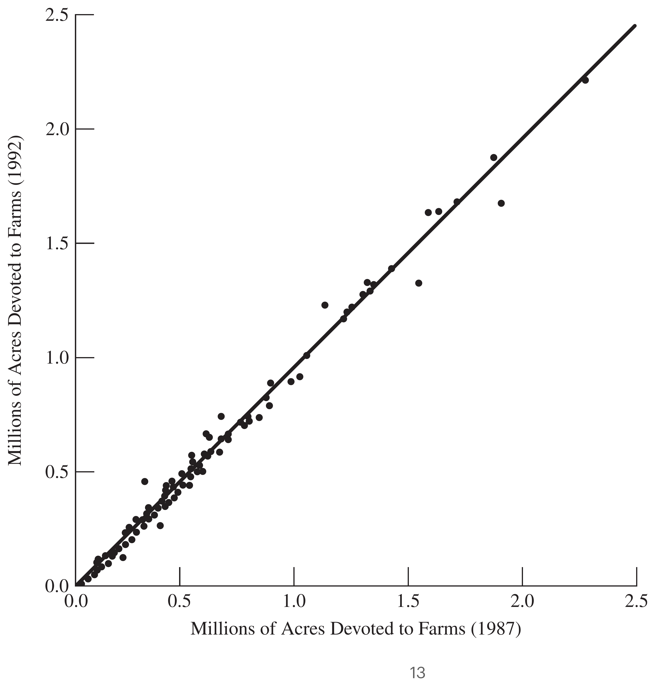

```{r setup}
#| include: false
knitr::opts_chunk$set(
  echo = FALSE,
  fig.align = "center"
)
```

# Ratio Estimation

Textbook sections:

- Lohr: 4.1--4.4
- Scheaffer et al: 6.1--6.6 + 5.10 (5.10 is about post-stratification)

## Ratio Estimation in a Simple Random Sample

For ratio estimation to apply, two quantities $y_i$ and $x_i$ must be measured on
each sample unit; $x_i$ is often called an **auxiliary variable** or **subsidiary
variable**. In the population of size $N$,
$$
t_y = \sum_{i=1}^N y_i, \qquad t_x = \sum_{i=1}^N x_i
$$
and their ratio is
$$
B = \frac{t_y}{t_x} = \frac{\bar y_U}{\bar x_U}, \qquad \text{so that} \qquad \bar y_U = B\cdot\bar x_U.
$$

Ratio and regression estimation both take advantage of the correlation of $x$
and $y$ in the population; the higher the correlation, the better they work.

## Estimators for an SRS

If an SRS is taken, natural estimators for $B$, $t_y$, and $\bar y_U$ are:
$$
\hat B = \frac{\bar y}{\bar x} = \frac{\hat t_y}{\hat t_x}
$$
$$
\hat t_{yr} = \hat B\, t_x = \hat y_r \cdot N
\qquad
\hat{\bar y}_r = \hat B\, \bar x_U
$$

where $t_x$ and $\bar x_U$ are assumed **known**. This is the key requirement for
ratio estimation: we need to know the population total or mean of the auxiliary
variable $x$ in advance.

## Illustration of Ratio Estimation

:::: {.columns}

::: {.column width="60%"}

```{r}
#| label: fig-ratio-concept
#| fig-cap: "Illustration of Benefits of Ratio Estimation"
#| fig-width: 6.5
#| fig-height: 5
#| out-width: "95%"
set.seed(200)
N <- 40
B_true <- 0.55
x <- runif(N, 0.5, 10)
y <- B_true * x + rnorm(N, 0, 0.20 * sqrt(x))

xbar_U <- mean(x)
ybar_U <- mean(y)

n <- 8
sel <- order(x)[1:n]              # biased sample: units with the smallest x
Bhat <- sum(y[sel]) / sum(x[sel]) # ratio estimate, computed from the sample only

yhat <- Bhat * x                  # fitted value for every unit in the population
ybar_ratio <- mean(yhat)          # = Bhat * xbar_U (the ratio estimate)
ybar_srs <- mean(y[sel])          # naive sample mean, ignoring x

par(mar = c(4, 4, 0.5, 0.5))
plot(x, y, pch = 19, col = "grey50", xlab = "x", ylab = "y",
     xlim = c(0, 10.5), ylim = c(0, 7))

abline(0, Bhat, col = "firebrick", lwd = 2)
text(9.3, Bhat * 9.3 + 0.4, expression(y == hat(B) * x), col = "firebrick")

points(x[sel], y[sel], pch = 21, col = "darkgreen", lwd = 2, cex = 2.2)
points(x, yhat, pch = 19, col = "firebrick", cex = 0.9)

abline(h = ybar_U, col = "black", lty = 3)
abline(h = ybar_ratio, col = "firebrick", lty = 3)
abline(h = ybar_srs, col = "darkgreen", lty = 3)

points(0, ybar_U, pch = 19, col = "black", cex = 2)
points(0, ybar_ratio, pch = 19, col = "firebrick", cex = 1.6)
points(0, ybar_srs, pch = 19, col = "darkgreen", cex = 1.6)

text(0.2, ybar_U, expression(bar(y)[U]), col = "black", adj = c(0, -0.7), font = 2)
text(0.2, ybar_ratio, expression(hat(bar(y))[r]), col = "firebrick", adj = c(0, 1.4), font = 2)
text(0.2, ybar_srs, expression(bar(y)), col = "darkgreen", adj = c(0, -0.7), font = 2)
```

:::

::: {.column width="40%"}

* Grey: population ($x_i$ known). Green: **biased sample** (small $x$ only).

* Red line, fit from the sample: $\hat y_i=\hat Bx_i$ for every unit.

$$
\hat{\bar y}_r = \frac1N\sum_{i=1}^N \hat y_i = \hat{B}\overline{x}_{\mathcal{U}}
$$

* $\hat{\bar y}_r$ (red) $\approx \bar y_{\mathcal{U}}$ (black), while the naive
$\bar y$ (green) is badly biased.

:::

::::

## Deriving the Ratio Estimator from Fitted Values

Once $\hat B$ is estimated, form the **fitted value** $\hat y_i=\hat B x_i$
for every unit in the population, using its known $x_i$. Summing (or
averaging) these over the population recovers the ratio estimators:
$$
\hat t_{yr} = \sum_{i=1}^N \hat y_i = \hat B\, t_x
\qquad
\hat{\bar y}_r = \frac1N\sum_{i=1}^N \hat y_i = \hat B\, \bar x_{\mathcal{U}}.
$$

In the figure, this is the height of the red line at $x=\bar x_{\mathcal{U}}$:
anchoring it at the known population mean pulls the estimate back near the
true $\bar y_{\mathcal{U}}$, despite the sample being biased toward small $x$.

# Examples of Ratio Estimation

## Revisiting SRS Estimators

Ordinary SRS estimation of a mean or proportion is a special case of ratio
estimation, obtained by setting $x_i=1$ for every unit:
$$
\bar x_U = 1, \quad \bar x = 1, \quad t_x = N
$$
$$
B = \bar y_U, \qquad \hat B = \bar y
$$
$$
\hat{\bar y}_r = \hat B\,\bar x = \hat B = \bar y \ \ (\text{including } \hat p)
\qquad
\hat t_{yr} = \hat B\, t_x = \bar y N
$$

## Example: Estimating France's Population

Let $x_i$ = number of registered births in commune $i$, and $y_i$ = number of
residents in commune $i$. Suppose the total number of registered births in all
communes is known to be $t_x=1$ million.
$$
\hat B = \frac{\hat t_y}{\hat t_x} = \frac{2{,}037{,}615}{71{,}866} = 28.35
$$
$$
\hat t_y = \hat B\, t_x = 28.35 \times 1\text{ million} = 28.35\text{ million}
$$

## Example: Field Yield

Suppose the population consists of agricultural fields of different sizes. Let
$$
y_i = \text{bushels of grain harvested in field } i, \qquad
x_i = \text{acreage of field } i.
$$
Then
$$
B = \text{average yield in bushels per acre}, 
$$
$$
\bar y_{\mathcal{U}} = \text{average yield in bushels per field}, 
$$
$$
t_y = \text{total yield in bushels.}
$$

$t_x$ (total acreage) is usually easy to obtain from other records, even when
$t_y$ (total yield) is not — making ratio estimation attractive here.

## Example: Estimating Agricultural Acreages

Suppose we know the population totals for 1987, but only have information on
the SRS of 300 counties for 1992. When the same quantity is measured at
different times, an earlier measurement often makes an excellent auxiliary
variable. Let
$$
y_i = \text{total farm acreage of county } i \text{ in 1992}, \qquad
$$
$$
x_i = \text{total farm acreage of county } i \text{ in 1987}.
$$

In 1987, a total of $t_x = 964{,}470{,}625$ acres were devoted to farms in the
U.S., so
$$
\bar x_U = \frac{964{,}470{,}625}{3078} = 313{,}343.3 \text{ acres of farms per county.}
$$

## Example: Computing the Ratio Estimate

From the sample of 300 counties: $\bar y = 297{,}897.0$, $\bar x = 301{,}953.7$.
$$
\hat B = \frac{\bar y}{\bar x} = \frac{297{,}897.0}{301{,}953.7} = 0.986565
$$
$$
\hat{\bar y}_r = \hat B\,\bar x_U = (0.986565)(313{,}343.3) = 309{,}133.6
$$
$$
\hat t_{yr} = \hat B\, t_x = (0.986565)(964{,}470{,}625) = 951{,}513{,}191
$$

Compare with the plain SRS estimate $\hat t_{y,\text{SRS}} = N\bar y = 916{,}927{,}110$
— quite different, since $\bar x$ in the sample happened to be a bit smaller
than the true $\bar x_U$.

## Figure: Acreage 1992 vs. 1987

{fig-align="center" width="70%"}

The line goes through the origin with slope $\hat B=0.9866$. Note that the
variability about the line **increases with $x$** — this pattern (variance
proportional to $x$) is exactly when ratio estimation works best.


# Estimating Standard Errors of Ratio Estimates

## MSE of the Ratio Mean Estimator {.smaller}

In large samples, the bias of the ratio estimator $\hat{\bar y}_r$ is negligible relative to its variance, so $\text{MSE}(\hat{\bar y}_r) \approx V(\hat{\bar y}_r)$. To understand the variance intuitively, look at the estimation error:

$$\hat{\bar y}_r - \bar y_U = \frac{\bar y}{\bar x}\bar x_U - B\bar x_U$$

By factoring out $\frac{\bar x_U}{\bar x}$, we can rewrite this error entirely in terms of the sample means:

$$\hat{\bar y}_r - \bar y_U = \frac{\bar x_U}{\bar x}(\bar y - B\bar x)$$

Define the **population residual** for each element as the deviation from the true population line:


$$d_i = y_i - Bx_i \qquad (\text{where } B = t_y/t_x)$$

Notice that $\bar y - B\bar x$ is simply the sample mean of these residuals, $\bar d$. Therefore, the error of our estimator is just the scaled sample mean of the residuals. Squaring this and taking the expectation gives us the MSE:

$$\text{MSE}(\hat{\bar y}_r) \approx E\left[\Big(\frac{\bar x_U}{\bar x}\Big)^2 \bar d^2\right] \approx \Big(\frac{\bar x_U}{\bar x}\Big)^2 V(\bar d)$$

Because $d_i$ are fixed population values, $\bar d$ is just a standard sample mean, meaning its variance under Simple Random Sampling is $V(\bar d) = (1 - \frac{n}{N})\frac{S_d^2}{n}$.

## Estimating SEs of Ratio Estimates {.smaller}

In practice, the true population slope $B$ is unknown, so we cannot calculate $d_i$ or $S_d^2$. Instead, we substitute $B$ with our sample estimate $\hat B = \bar y / \bar x$. This gives us the **sample residuals** from our fitted line:

$$e_i = y_i - \hat B x_i$$

Let $s_e^2 = \frac{1}{n-1}\sum_{i\in\mathcal S} e_i^2$ be the sample variance of these residuals. Substituting $s_e^2$ for the unknown $S_d^2$ provides the variance estimator for the ratio mean:

$$\hat V(\hat{\bar y}_r) = \Big(1-\frac nN\Big)\Big(\frac{\bar x_U}{\bar x}\Big)^2\frac{s_e^2}{n}$$

From this core formula, we can easily derive the variances for the slope and the total by recognizing their algebraic relationships ($\hat B = \hat{\bar y}_r / \bar x_U$ and $\hat t_{yr} = N\hat{\bar y}_r$):

$$\hat V(\hat B) = \Big(1-\frac nN\Big)\frac{s_e^2}{n\bar x^2} \qquad \hat V(\hat t_{yr}) = \Big(1-\frac nN\Big)\Big(\frac{t_x}{\bar x}\Big)^2\frac{s_e^2}{n}$$

If sample sizes are sufficiently large (typically $n > 30$), the sampling distributions are approximately normal. Approximate 95% Confidence Intervals are formed using the standard multiplier:

* **Slope:** $\hat B \pm 1.96\,\text{SE}(\hat B)$
* **Mean:** $\hat{\bar y}_r \pm 1.96\,\text{SE}(\hat{\bar y}_r)$
* **Total:** $\hat t_{yr} \pm 1.96\,\text{SE}(\hat t_{yr})$


## Example: France Population Estimation {.smaller}

This toy version of the France population example demonstrates ratio estimation mechanics using a sample of $n=5$ out of $N=8$ communes. We observe $x_i$ = registered births and $y_i$ = residents, both in **thousands**:

:::: {.columns}

::: {.column width="60%"}

| Commune $i$ | $x_i$ (000s) | $y_i$ (000s) | $\hat y_i=\hat Bx_i$ | $e_i=y_i-\hat y_i$ | $e_i^2$ |
| --- | --- | --- | ----- | ----- | --- |
| 1 | 1 | 18 | 30 | −12 | 144 |
| 2 | 2 | 78 | 60 | 18 | 324 |
| 3 | 3 | 62 | 90 | −28 | 784 |
| 4 | 4 | 132 | 120 | 12 | 144 |
| 5 | 5 | 160 | 150 | 10 | 100 |
| **Sum** | **15** | **450** | **450** | **0** | **1496** |

We first calculate the ratio estimate of the slope $\hat B$, followed by the sample residual variance $s_e^2$:


$$\hat B = \frac{\sum y_i}{\sum x_i} = \frac{450}{15} = 30 \qquad s_e^2 = \frac{\sum e_i^2}{n-1} = \frac{1496}{4} = 374$$

:::

::: {.column width="40%"}

```{r}
#| label: fig-france-toy
#| fig-width: 5
#| fig-height: 4.5
#| out-width: "100%"
x <- c(1, 2, 3, 4, 5)
y <- c(18, 78, 62, 132, 160)
Bhat <- sum(y) / sum(x)
yhat <- Bhat * x
e <- y - yhat

par(mar = c(4, 4, 0.5, 0.5))
plot(x, y, pch = 19, cex = 1.4, xlab = "x: registered births (000s)", ylab = "y: residents (000s)",
     xlim = c(0, 6), ylim = c(0, 180))
abline(0, Bhat, col = "firebrick", lwd = 2)
segments(x, y, x, yhat, col = "grey40", lty = 2)
points(x, yhat, pch = 21, col = "firebrick", bg = "white", cex = 1.2)
text(x + 0.15, (y + yhat) / 2, sprintf("e=%d", e), cex = 0.8, adj = 0)
text(5.3, Bhat * 5.3, expression(y == hat(B) * x), col = "firebrick", adj = 0)

```

:::

::::

## Example: France Population Estimation {.smaller}

Assume the population has $N=8$ communes and the total number of registered births is known from administrative records to be $t_x=40$ (thousand). This means the true population mean is $\bar x_{\mathcal{U}}=t_x/N=5$ (thousand). Our sample mean is only $\bar x=3$ (thousand), indicating we sampled smaller-than-average communes.

**Mean:** $\hat{\bar y}_r=\hat B\bar x_{\mathcal{U}}=30(5)=150$ (thousand residents)


$$\text{SE}(\hat{\bar y}_r) = \sqrt{\Big(1-\frac{5}{8}\Big)\Big(\frac{5}{3}\Big)^2\frac{374}{5}} = 8.827$$

**Total:** $\hat t_{yr}=\hat B\,t_x=30(40)=1200$ (thousand), i.e. **1.2 million** residents


$$\text{SE}(\hat t_{yr}) = \sqrt{\Big(1-\frac{5}{8}\Big)\Big(\frac{40}{3}\Big)^2\frac{374}{5}} = 70.616 \text{ (thousand)}$$

A 95% Confidence Interval for the total population size: $1200 \pm 1.96(70.616) = [1061.6,\ 1338.4]$ thousand, i.e. **[1.062, 1.338] million** residents.


**Slope:**


$$\text{SE}(\hat B) = \sqrt{\Big(1-\frac{5}{8}\Big)\frac{374}{5\cdot 3^2}} = 1.765$$

# Efficiency of Ratio Estimation


## When Does Ratio Estimation Help?

Let $R$ be the population Pearson correlation of $x$ and $y$,
$$
R = \frac{\sum_{i=1}^N (x_i-\bar x_U)(y_i-\bar y_U)}{(N-1)S_xS_y}.
$$

Comparing $\text{MSE}(\hat{\bar y}_r)$ with $\text{MSE}(\bar y) = \big(1-\tfrac nN\big)\tfrac{S_y^2}{n}$
shows that
$$
\text{MSE}(\hat{\bar y}_r) \le \text{MSE}(\bar y) \quad \Longleftrightarrow \quad
R \ge \frac{BS_x}{2S_y} = \frac{\text{CV}(x)}{2\,\text{CV}(y)}.
$$

If the CVs of $x$ and $y$ are roughly equal, ratio estimation pays off whenever
the correlation between $x$ and $y$ exceeds $1/2$.

## Percentage of Variance Reduction

Analogous to $R^2$ for stratification,
$$
\frac{\text{MSE}(\hat{\bar y}_r)}{\text{MSE}(\bar y)} \approx \frac{S_d^2}{S_y^2}
\qquad\Longrightarrow\qquad
R^2 = 1 - \frac{S_d^2}{S_y^2}
$$

::: {.callout-note}
This is not exactly the $R^2$ of fitting a linear regression model $y=Bx$,
because $\hat B$ is not a least-squares estimate of $B$; however, it carries
similar information about how much variance ratio estimation removes.
:::

# Post-Stratification

## An Example

Sometimes a unit's stratum is unknown until *after* sampling (e.g., gender
before interviewing). We can still **poststratify**: take an SRS, sort units
into strata afterward, and weight each by its *known* population share $N_h/N$.

| Stratum | $N_h$ | $n_h$ | Want nurse | $\hat p_h$ |
|:---|---:|---:|---:|---:|
| Female | 5000 | 300 | 150 | 0.50 |
| Male | 5000 | 100 | 10 | 0.10 |

The sample has three times as many women as men, though the population is
50/50. Ignoring this pulls
$\hat p_{\text{SRS}} = \frac{160}{400} = (0.5)(0.75)+(0.1)(0.25) = 0.4$ toward
the female (higher) rate. Weighting by the *known* population shares instead
gives
$$
\hat p_{\text{post}} = \hat p_f\frac{N_f}{N} + \hat p_m\frac{N_m}{N}
 = (0.5)(0.5)+(0.1)(0.5) = 0.3 .
$$

## Post-Stratified Mean and Its Standard Error 

With $H$ post-strata formed after an SRS of size $n$, contrast two weightings
of the same stratum means $\bar y_h$, $\pi_h=N_h/N$:
$$
\hat{\bar y}_{\text{SRS}} = \sum_{h=1}^H \frac{n_h}{n}\,\bar y_h
\qquad\text{vs.}\qquad
\hat{\bar y}_{\text{post}} = \sum_{h=1}^H \pi_h\,\bar y_h .
$$

Since $n_h$ is random, the variance formula plugs in its expectation,
$$
n_h^{\text{post-strat}} := n\pi_h,
$$
$$
\hat V(\hat{\bar y}_{\text{post}}) = \sum_{h=1}^H \Big(1-\frac{n_h^{\text{post-strat}}}{N_h}\Big)\pi_h^2\frac{s_h^2}{n_h^{\text{post-strat}}}
$$

Total: $\hat t_{\text{post}} = N\hat{\bar y}_{\text{post}}$,
$\text{SE}(\hat t_{\text{post}}) = N\cdot\text{SE}(\hat{\bar y}_{\text{post}})$.

## Predictive View: $\hat t_{\text{post}} = \sum_{i\in\mathcal U}\hat y_i$

Every total estimator can be read as *predicting* each population unit's $y_i$
and summing. Post-stratification predicts every unit in stratum $h$ by that
stratum's sample mean, $\hat y_i=\bar y_h$ for $i\in\mathcal U_h$:
$$
\hat t_{\text{post}} = \sum_{i\in\mathcal U}\hat y_i = \sum_{h=1}^H N_h\,\bar y_h,
\qquad
\hat{\bar y}_{\text{post}} = \sum_{h=1}^H \pi_h\,\bar y_h .
$$

The naive SRS estimator instead predicts *every* unit by the pooled $\bar y$
($\hat t_{\text{SRS}}=N\bar y$), so an over-represented stratum drags $\bar y$
toward its own mean; post-stratification fixes this by predicting with the
right stratum mean, weighted by the correct $N_h$.

## Illustration of Post-Stratification

:::: {.columns}

::: {.column width="60%"}

```{r}
#| label: fig-poststrat-concept
#| fig-cap: "Illustration of Benefits of Post-Stratification"
#| fig-width: 6.5
#| fig-height: 5
#| out-width: "95%"
set.seed(12)
Nh <- c(50, 20, 30, 40)      # population sizes per post-stratum
mu_h <- c(1, 4, 7, 10)       # true stratum means, exaggerated and ascending
labs <- c("A", "B", "C", "D")
N <- sum(Nh)
H <- length(Nh)
nh <- c(20, 2, 2, 1)         # biased sample: A is 80% of the sample but only 36% of the population
sdy <- 0.9

pop_y <- lapply(1:H, function(h) mu_h[h] + rnorm(Nh[h], 0, sdy))
ybar_U <- mean(unlist(pop_y))            # true population mean

sel_idx <- lapply(1:H, function(h) sample(Nh[h], nh[h])) # SRS within each stratum
ybar_h <- sapply(1:H, function(h) mean(pop_y[[h]][sel_idx[[h]]])) # per-stratum sample means

ybar_naive <- mean(unlist(lapply(1:H, function(h) pop_y[[h]][sel_idx[[h]]]))) # pooled, ignoring strata
ybar_post <- sum(ybar_h * Nh / N)        # post-stratified estimate

# index plot: sequential index across the population, grouped contiguously by
# stratum -- so each stratum's width on the x-axis is exactly its Nh
boundaries <- cumsum(Nh)
starts <- c(0, boundaries[-H])
x_pop <- unlist(lapply(1:H, function(h) starts[h] + seq_len(Nh[h])))
y_pop <- unlist(pop_y)
strat_id <- rep(1:H, Nh)

par(mar = c(3, 4, 0.5, 0.5))
plot(x_pop, y_pop, pch = 19, col = "grey50", xlab = "", ylab = "y",
     xlim = c(-12, N), ylim = c(-2, 13), xaxt = "n")

abline(v = boundaries[-H], col = "grey70")           # separate the groups
mid <- (starts + boundaries) / 2
axis(1, at = mid, labels = labs, tick = FALSE)

for (h in 1:H) {
  idx <- which(strat_id == h)
  sel <- idx[sel_idx[[h]]]
  points(x_pop[sel], y_pop[sel], pch = 21, col = "darkgreen", lwd = 2, cex = 2.2)
  segments(starts[h], ybar_h[h], boundaries[h], ybar_h[h], col = "firebrick", lwd = 3)
}

abline(h = ybar_U, col = "black", lty = 3)
abline(h = ybar_post, col = "firebrick", lty = 3)
abline(h = ybar_naive, col = "darkgreen", lty = 3)

points(-11, ybar_U, pch = 19, col = "black", cex = 2, xpd = NA)
points(-11, ybar_post, pch = 19, col = "firebrick", cex = 1.6, xpd = NA)
points(-11, ybar_naive, pch = 19, col = "darkgreen", cex = 1.6, xpd = NA)

text(-10, ybar_U, expression(bar(y)[U]), col = "black", adj = c(0, -0.7), font = 2)
text(-10, ybar_post, expression(hat(bar(y))[post]), col = "firebrick", adj = c(0, 1.4), font = 2)
text(-10, ybar_naive, expression(bar(y)), col = "darkgreen", adj = c(0, -0.7), font = 2)
```

:::

::: {.column width="40%"}

* Grey: population, post-strata A–D (block width = $N_h$). Green: **biased
  sample** — 80% from A, though A is only 36% of the population.

* Red segments: predictions $\hat y_i=\bar y_h$ per stratum, giving
$$
\hat{\bar y}_{\text{post}} = \sum_{h=1}^H \pi_h\,\bar y_h .
$$

* $\hat{\bar y}_{\text{post}}$ (red) $\approx \bar y_{\mathcal{U}}$ (black); the
  naive $\bar y$ (green) is pulled toward A.

:::

::::

## Example: Post-Stratification Spreadsheet

Nurses example ($N=10{,}000$, $n=400$): $\hat p_h$ plays the role of $\bar y_h$,
$s_h^2=\tfrac{n_h}{n_h-1}\hat p_h(1-\hat p_h)$ from the realized counts, and we
set $n_h^{\text{post-strat}}=n\pi_h=200$ in each stratum, so every fpc is $1-n/N=0.96$:

| Post-stratum | $N_h$ | $\pi_h$ | $n_h^{\text{post-strat}}$ | $\hat p_h$ | $s_h^2$ | $\pi_h\hat p_h$ | $\hat v_h$[^vhpost] |
|:---|---:|---:|---:|---:|---:|---:|---:|
| Female | 5000 | 0.5 | 200 | 0.500 | 0.2508 | 0.2500 | 0.000301 |
| Male | 5000 | 0.5 | 200 | 0.100 | 0.0909 | 0.0500 | 0.000109 |
| **Total** | **10000** | **1.0** | **400** | | | **0.3000** | **0.000410** |

[^vhpost]: $\hat v_h = \big(1-\tfrac{n_h^{\text{post-strat}}}{N_h}\big)\pi_h^2\tfrac{s_h^2}{n_h^{\text{post-strat}}}$.
Using the realized $n_h$ (300, 100) instead gives $\hat V=0.000419$ — nearly identical.

## Example: Post-Stratification Results

The post-stratified proportion matches the earlier calculation, now with a
standard error:
$$
\hat p_{\text{post}} = \sum_{h} \pi_h\hat p_h = 0.300,
\qquad
\text{SE}(\hat p_{\text{post}}) = \sqrt{0.000410} = 0.0203,
$$
and an approximate 95% CI is
$$
0.300 \pm 1.96(0.0203) = [0.260,\ 0.340].
$$

Naively as an unstratified SRS: $\hat p_{\text{SRS}}=0.4$,
$\text{SE}(\hat p_{\text{SRS}}) = \sqrt{\big(1-\tfrac{400}{10000}\big)\tfrac{(0.4)(0.6)}{399}} \approx 0.0240$.
Post-stratification is both unbiased and more precise, since it removes the
between-sex variability from the standard error.


# Domain Analysis

## Domain Analysis

Suppose there are $D$ **domains** (subpopulations of interest determined only
*after* sampling — e.g., men and women). Let $\mathcal U_d$ be the population
units in domain $d$, and $\mathcal S_d$ the sampled units in domain $d$, with
$N_d = |\mathcal U_d|$ and $n_d = |\mathcal S_d|$.

We might want the mean salary for men and for women separately, but we don't
know a person's gender before selecting them — we can't stratify by domain in
advance. Instead we estimate each domain's mean/total after sampling, by
splitting the sample by domain ID. **Domain mean estimation is a special case
of ratio estimation.**

## Domain Means Are Ratio Estimates

Define
$$
x_i = \begin{cases}1 & i\in\mathcal U_d\\0 & i\notin\mathcal U_d\end{cases}
\qquad
u_i = y_ix_i = \begin{cases}y_i & i\in\mathcal U_d\\0 & i\notin\mathcal U_d\end{cases}
$$

Then $t_x=N_d$, $\bar x_U = N_d/N$, $\bar y_{U_d} = t_u/t_x = B$, $\bar x = n_d/n$, and
$$
\bar y_d = \hat B = \frac{\bar u}{\bar x} = \frac{\hat t_u}{\hat t_x}
 = \frac{\sum_{i\in\mathcal S_d} y_i}{n_d}
$$

Although $\bar y_d$ *looks* like an ordinary sample mean, $n_d$ itself is
random — a different SRS would very likely give a different $n_d$ — which is
exactly why this is a ratio estimator, not a simple mean.

## Standard Error of a Domain Mean

Applying the formula for $\hat V(\hat B)$ with $x_i,u_i$ as defined above
gives
$$
\text{SE}(\bar y_d) = \sqrt{\Big(1-\frac nN\Big)\frac{n}{n_d^2}\cdot\frac{(n_d-1)s_{yd}^2}{n-1}}
 \approx \sqrt{\Big(1-\frac nN\Big)\frac{s_{yd}^2}{n_d}},
$$
$s_{yd}^2$ being the sample variance of the $y_i$'s within domain $d$.

This is **not** the same as naively applying SRS *within* domain $d$, as if
$n_d$ were fixed — that would use $\big(1-\tfrac{n_d}{N_d}\big)$ in place of
$\big(1-\tfrac nN\big)$. Only the fpc differs: **overall** rate (correct,
since $n_d$ is random) vs. **domain** rate (wrong); they agree only when
$n_d/N_d\approx n/N$.

## Estimating a Domain Total

- If $N_d$ is **known**: $\hat t_{yd} = \bar y_d \times N_d$, with
  $\text{SE}(\hat t_{yd}) = \text{SE}(\bar y_d)\times N_d$.
- If $N_d$ is **unknown**: estimate it first, $\hat N_d = N\cdot n_d/n$, and use
  $\hat t_{yd} = \bar y_d \times \hat N_d = N\bar u$, with
  $$
  \text{SE}(\hat t_{yd}) = N\,\text{SE}(\bar u) = N\sqrt{\Big(1-\frac nN\Big)\frac{s_u^2}{n}}
  $$

## Example: Domain Means by Census Region 

Split the SRS of $n=300$ counties (`agsrs.csv`) by region; each $N_d$ is known
from the full Census (`agpop.csv`). The **naive** column applies ordinary SRS
estimation *within* each region, as if its $n_d$ had been fixed in advance:

```{r}
#| label: tbl-domain-agsrs
#| message: false
library(gt)
agsrs <- read.csv("data/agsrs.csv")
n <- nrow(agsrs); N <- 3078
Nd <- c(NE = 220, NC = 1054, S = 1382, W = 422)
region_names <- c(NE = "Northeast", NC = "North Central", S = "South", W = "West")

domain_tab <- do.call(rbind, lapply(names(region_names), function(r) {
  y <- agsrs$acres92[agsrs$region == r]
  nd <- length(y); ybar <- mean(y); s <- sd(y)
  se_domain <- sqrt((1 - n / N) * s^2 / nd)
  se_naive  <- sqrt((1 - nd / Nd[[r]]) * s^2 / nd)
  data.frame(Region = region_names[[r]], Nd = Nd[[r]], nd = nd,
             ybar = ybar, SE_domain = se_domain, SE_naive = se_naive)
}))

gt(domain_tab, rowname_col = "Region") |>
  fmt_number(columns = c(ybar, SE_domain, SE_naive), decimals = 1) |>
  cols_label(Nd = md("$N_d$"), nd = md("$n_d$"), ybar = md("$\\bar y_d$"),
             SE_domain = md("$\\text{SE}(\\bar y_d)$ correct"),
             SE_naive  = md("SE naive SRS"))
```

The two SEs differ only in the fpc: naive is bigger where $d$ happened to be
**under**-sampled ($n_d/N_d<n/N$: NE, NC) and smaller where **over**-sampled
($n_d/N_d>n/N$: S, W). The correct formula ignores this sampling luck and
always uses the overall rate $n/N$.

# Regression Estimation

## Linear Model

Ratio estimation works best if the data are well fit by a straight line
*through the origin*. Sometimes data instead appear evenly scattered about a
straight line that does **not** go through the origin — i.e., the data look as
though the usual straight-line regression model applies:
$$
y = B_0 + B_1 x
$$

## Ratio vs. Regression Estimation

```{r}
#| label: fig-ratio-vs-reg
#| fig-width: 9
#| fig-height: 4.5
#| out-width: "90%"
set.seed(9)
n <- 40
x <- runif(n, 1, 10)

par(mfrow = c(1, 2), mar = c(4, 4, 2, 0.5))

B <- 0.5
y1 <- B * x + rnorm(n, 0, 0.4 * sqrt(x))
plot(x, y1, pch = 19, xlab = "x", ylab = "y", xlim = c(0, 10.5), ylim = c(-1, 6),
     main = "Ratio Estimation")
abline(0, B, col = "firebrick", lwd = 2)
text(8.5, B * 8.5 + 0.6, expression(y == B*x), col = "firebrick")

B0 <- 1.5
B1 <- 0.35
y2 <- B0 + B1 * x + rnorm(n, 0, 0.6)
plot(x, y2, pch = 19, xlab = "x", ylab = "y", xlim = c(0, 10.5), ylim = c(-1, 6),
     main = "Regression Estimation")
abline(B0, B1, col = "firebrick", lwd = 2)
text(8.5, B0 + B1 * 8.5 + 0.6, expression(y == B[0]+B[1]*x), col = "firebrick")
```

In ratio estimation, $y_i = Bx_i + d_i$ with residual spread growing with $x$;
in regression estimation, $y_i = B_0+B_1x_i+d_i$ with roughly constant spread.

## Least Squares Estimation

The ordinary least squares slope and intercept:
$$
\hat B_1 = \frac{\displaystyle\sum_{i\in\mathcal S}(x_i-\bar x)(y_i-\bar y)}{\displaystyle\sum_{i\in\mathcal S}(x_i-\bar x)^2}
 = \frac{r s_y}{s_x}
\qquad
\hat B_0 = \bar y - \hat B_1 \bar x
$$

where $r$ is the sample Pearson correlation coefficient of $x$ and $y$.

## The Regression Estimator

Assuming $\bar x_U$ (or $t_x$) is known,
$$
\hat{\bar y}_{\text{reg}} = \hat B_0 + \hat B_1 \bar x_U = \bar y + \hat B_1(\bar x_U - \bar x)
$$

Equivalently, averaging the fitted value $\hat y_i = \hat B_0+\hat B_1 x_i$ over
*every* population unit gives the same estimator:
$$
\hat{\bar y}_{\text{reg}} = \frac1N\sum_{i=1}^N (\hat B_0 + \hat B_1 x_i) = \hat B_0 + \hat B_1 \bar x_U
$$

This is a natural generalization of the ratio estimator's $\hat{\bar
y}_r = \frac1N\sum_{i=1}^N \hat B x_i$. The corresponding total is
$\hat t_{y,\text{reg}} = N\hat{\bar y}_{\text{reg}} = N\hat B_0 + \hat B_1 t_x$.

## Illustration of Regression Estimation

:::: {.columns}

::: {.column width="60%"}

```{r}
#| label: fig-reg-concept
#| fig-cap: "Illustration of Benefits of Regression Estimation"
#| fig-width: 6.5
#| fig-height: 5
#| out-width: "95%"
set.seed(200)
N <- 40
B0 <- 1.5
B1 <- 0.35
x <- runif(N, 1, 10)
y <- B0 + B1 * x + rnorm(N, 0, 0.30)

xbar_U <- mean(x)
ybar_U <- mean(y)

n <- 8
sel <- order(x)[1:n]              # biased sample: units with the smallest x
xs <- x[sel]
ys <- y[sel]
B1hat <- sum((xs - mean(xs)) * (ys - mean(ys))) / sum((xs - mean(xs))^2)
B0hat <- mean(ys) - B1hat * mean(xs)  # least squares fit, from the sample only

yhat <- B0hat + B1hat * x         # fitted value for every unit in the population
ybar_reg <- mean(yhat)            # = B0hat + B1hat * xbar_U (the regression estimate)
ybar_srs <- mean(ys)              # naive sample mean, ignoring x

par(mar = c(4, 4, 0.5, 0.5))
plot(x, y, pch = 19, col = "grey50", xlab = "x", ylab = "y",
     xlim = c(0, 10.5), ylim = c(0, 6.5))

abline(B0hat, B1hat, col = "firebrick", lwd = 2)
text(8.2, B0hat + B1hat * 8.2 + 0.4, expression(y == hat(B)[0] + hat(B)[1] * x), col = "firebrick")

points(x[sel], y[sel], pch = 21, col = "darkgreen", lwd = 2, cex = 2.2)
points(x, yhat, pch = 19, col = "firebrick", cex = 0.9)

abline(h = ybar_U, col = "black", lty = 3)
abline(h = ybar_reg, col = "firebrick", lty = 3)
abline(h = ybar_srs, col = "darkgreen", lty = 3)

points(0, ybar_U, pch = 19, col = "black", cex = 2)
points(0, ybar_reg, pch = 19, col = "firebrick", cex = 1.6)
points(0, ybar_srs, pch = 19, col = "darkgreen", cex = 1.6)

text(0.2, ybar_U, expression(bar(y)[U]), col = "black", adj = c(0, -0.7), font = 2)
text(0.2, ybar_reg, expression(hat(bar(y))[reg]), col = "firebrick", adj = c(0, 1.4), font = 2)
text(0.2, ybar_srs, expression(bar(y)), col = "darkgreen", adj = c(0, -0.7), font = 2)
```

:::

::: {.column width="40%"}

* Grey: population ($x_i$ known). Green: **biased sample** (small $x$ only).

* Red line, fit from the sample: $\hat y_i=\hat B_0+\hat B_1x_i$ for every unit.

$$
\hat{\bar y}_{\text{reg}} = \frac1N\sum_{i=1}^N \hat y_i
 = \hat B_0 + \hat B_1 \bar x_{\mathcal{U}}
$$

* $\hat{\bar y}_{\text{reg}}$ (red) $\approx \bar y_{\mathcal{U}}$ (black), while
the naive $\bar y$ (green) is badly biased.

:::

::::

## Estimating the Standard Error

Let $e_i = y_i - (\hat B_0+\hat B_1 x_i)$ be the regression residuals, and
$$
s_e^2 = \frac{\sum_{i\in\mathcal S} e_i^2}{n-2}.
$$

Then
$$
\text{SE}(\hat{\bar y}_{\text{reg}}) = \sqrt{\Big(1-\frac nN\Big)\frac{s_e^2}{n}}
 = \sqrt{\Big(1-\frac nN\Big)\frac1n\, s_y^2(1-r^2)}
$$

where $r$ is the Pearson correlation coefficient between $x$ and $y$ in the
sample — the stronger the linear relationship, the smaller the SE.

## Example: Correcting Aerial Survey Counts

Aerial photographs are a cheap way to survey a large area (e.g., for a caribou
herd), but tend to **undercount** animals that are hidden from view overhead.
A more expensive, intensive ground/field count on a subsample of plots gives
accurate counts that can calibrate the photo counts.

```{r}
#| label: fig-photo-field
#| fig-width: 6.5
#| fig-height: 5
#| out-width: "60%"
set.seed(6)
n <- 25
x <- round(runif(n, 2, 30))          # photo (undercounted) counts
y <- round(1.35 * x + rnorm(n, 0, 2)) # true field counts

par(mar = c(4, 4, 0.5, 0.5))
plot(x, y, pch = 19, xlab = "Photo count  (x)", ylab = "Field count  (y)",
     xlim = c(0, 32), ylim = c(0, 45))
abline(lm(y ~ 0 + x), col = "firebrick", lwd = 2)
abline(0, 1, col = "gray50", lty = 2)
text(28, 28, "y = x", col = "gray50", pos = 3)
```

Let $x_i$ = photo count and $y_i$ = field count on plot $i$. Fitting
$\hat B = \bar y/\bar x$ on the subsample of plots with both counts, we can
correct the total photo count of the *entire* surveyed area,
$\hat t_{yr} = \hat B\, t_x$, for the systematic undercounting bias.

# Predictions with Machine Learning Models

## Illustration: A Flexible Curve Instead of a Line

:::: {.columns}

::: {.column width="60%"}

```{r}
#| label: fig-ml-concept
#| fig-cap: "Illustration of Benefits of a Machine-Learning Prediction Model"
#| fig-width: 6.5
#| fig-height: 5
#| out-width: "95%"
set.seed(37)
N <- 40
f <- function(x) 2 + 2.5 * sin(0.8 * x) + 0.35 * x   # true, nonlinear E[y|x]
x <- runif(N, 0.5, 10)
y <- f(x) + rnorm(N, 0, 0.3)

ybar_U <- mean(y)

n <- 15
sel <- sample(N, n)                     # an ordinary SRS, spread across x
df <- data.frame(xx = x[sel], yy = y[sel])

fit_curve <- loess(yy ~ xx, data = df, span = 0.9,
                    control = loess.control(surface = "direct")) # "ML" model
fit_lm <- lm(yy ~ xx, data = df)                                  # linear model

xg <- seq(0.3, 10.2, length.out = 200)
curve_g <- predict(fit_curve, newdata = data.frame(xx = xg))
lm_g <- predict(fit_lm, newdata = data.frame(xx = xg))

yhat <- predict(fit_curve, newdata = data.frame(xx = x)) # fitted value, every unit
ybar_ml <- mean(yhat)                   # model-based (ML) estimate
ybar_srs <- mean(y[sel])                # naive sample mean

par(mar = c(4, 4, 0.5, 0.5))
plot(x, y, pch = 19, col = "grey50", xlab = "x", ylab = "y",
     xlim = c(0, 10.5), ylim = c(0, 8))

lines(xg, lm_g, col = "steelblue", lwd = 2, lty = 2)
lines(xg, curve_g, col = "firebrick", lwd = 2)
text(9.0, tail(curve_g, 1) + 0.5, "ML curve", col = "firebrick")
text(9.0, tail(lm_g, 1) - 0.5, "linear fit", col = "steelblue")

points(x[sel], y[sel], pch = 21, col = "darkgreen", lwd = 2, cex = 2.2)
points(x, yhat, pch = 19, col = "firebrick", cex = 0.9)

abline(h = ybar_U, col = "black", lty = 3)
abline(h = ybar_ml, col = "firebrick", lty = 3)
abline(h = ybar_srs, col = "darkgreen", lty = 3)

points(0, ybar_U, pch = 19, col = "black", cex = 2)
points(0, ybar_ml, pch = 19, col = "firebrick", cex = 1.6)
points(0, ybar_srs, pch = 19, col = "darkgreen", cex = 1.6)

text(0.2, ybar_U, expression(bar(y)[U]), col = "black", adj = c(0, -0.7), font = 2)
text(0.2, ybar_ml, expression(hat(bar(y))[ML]), col = "firebrick", adj = c(0, 1.4), font = 2)
text(0.2, ybar_srs, expression(bar(y)), col = "darkgreen", adj = c(0, -0.7), font = 2)
```

:::

::: {.column width="40%"}

Grey: population ($x_i$ known). Green: an ordinary SRS.

The true relationship is **curved**; a straight line (blue, dashed)
underfits it, but a flexible model (red curve) tracks it closely.

$$
\hat{\bar y}_{\text{ML}} = \frac1N\sum_{i=1}^N \hat y_i
$$

$\hat{\bar y}_{\text{ML}}$ (red) $\approx \bar y_{\mathcal{U}}$ (black), much
closer than either the naive $\bar y$ (green) or a straight-line fit.

:::

::::

## The Prediction (Model-Based) Estimator

Ratio and regression assume a specific form for $E[y\mid x]$. More generally,
fit **any** model $\hat m(\cdot)$ (smoother, tree, forest, neural net, ...) to
the sample, and predict every population unit:
$$
\hat y_i = \hat m(x_i), \qquad i=1,\dots,N.
$$

$$
\hat{\bar y}_{\text{pred}} = \frac1N\sum_{i=1}^N \hat y_i
\qquad
\hat t_{y,\text{pred}} = \sum_{i=1}^N \hat y_i
$$

Ratio/regression are special cases: $\hat m(x)=\hat Bx$ and $\hat
m(x)=\hat B_0+\hat B_1x$.

::: {.callout-note}
Since $\hat m$ may be nonlinear, this needs every $x_i$, not just $\bar
x_{\mathcal{U}}$ — and SE is usually estimated by the bootstrap.
:::
