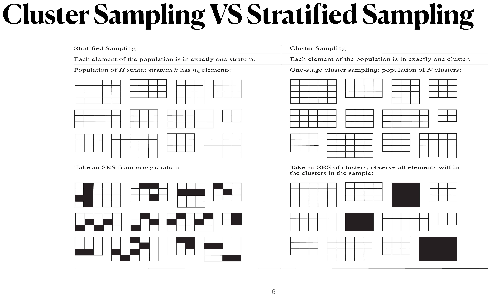
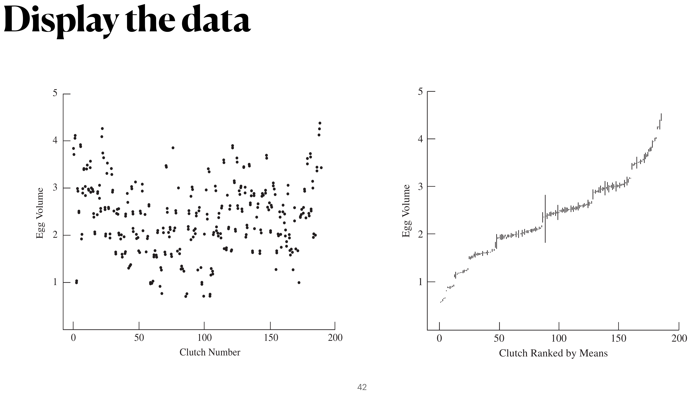

```{r setup}
#| include: false
knitr::opts_chunk$set(
  echo = FALSE,
  fig.align = "center"
)
```

# General Terms for Cluster Sampling

Textbook sections:

- 5.1--5.3 in Lohr
- Ch 8 and 9 in Scheaffer et al.

## An Example of Clusters

Suppose we want to find out how many bicycles are owned by residents in a
community of 10,000 households. We could take an SRS of 400 households, or we
could divide the community into blocks of about 20 households each and sample
every household (or subsample some households) in each of 20 blocks selected
at random from the 500 blocks in the community.

The latter plan is an example of **cluster sampling**. The blocks are the
**primary sampling units (psus)**, or **clusters**. The households are the
**secondary sampling units (ssus)**; often the ssus are the elements of the
population.

## Why Do We Use Cluster Sampling?

- **Constructing a sampling frame of observation units may be difficult,
  expensive, or impossible.** We cannot list all honeybees in a region or all
  customers of a store; we may be able to construct a list of individuals in a
  city only via a list of housing units, but that list is time-consuming and
  expensive to build.
- **The population may be widely spread out geographically, or occur in
  natural clusters** such as households or schools, and it is cheaper to
  sample clusters than to take an SRS of individuals. To survey nursing-home
  residents, it is much cheaper to sample nursing homes and interview every
  resident there than to take an SRS of residents (which might require
  traveling to a home to interview just one person).

## Cluster Sampling vs. Stratified Sampling

{fig-align="center" width="90%"}

In stratified sampling, every stratum is sampled and precision depends on
**within-stratum** homogeneity. In cluster sampling, only *some* clusters are
sampled and precision depends primarily on the variability **between cluster
means**.

## Notation for Cluster Sampling

The universe $\mathcal U$ is the population of $N$ psus; $\mathcal S$ is the
sample of psus, and $\mathcal S_i$ is the sample of ssus chosen from psu $i$.
The measured quantity is
$$
y_{ij} = \text{measurement for the } j\text{th element (ssu) in the } i\text{th psu.}
$$

In cluster sampling, $N$ is the number of psus, **not** the number of
observation units — a departure from earlier chapters where $N$ was the
population size in elements.

## psu-Level Population Quantities

$$
N = \text{number of psus}, \qquad M_i = \text{number of ssus in psu } i, \qquad
M_0 = \sum_{i=1}^N M_i
$$
$$
t_i = \sum_{j=1}^{M_i} y_{ij} \quad(\text{psu total}) \qquad\qquad
t = \sum_{i=1}^N t_i \quad(\text{population total})
$$
$$
S_t^2 = \frac{1}{N-1}\sum_{i=1}^N \Big(t_i - \frac tN\Big)^2 \quad(\text{population variance of psu totals})
$$

## ssu-Level Population Quantities

$$
\bar y_U = \frac{\sum_{i=1}^N\sum_{j=1}^{M_i} y_{ij}}{M_0} = \frac{t}{M_0} \quad(\text{population mean})
$$
$$
\bar y_{iU} = \frac{\sum_{j=1}^{M_i} y_{ij}}{M_i} = \frac{t_i}{M_i} \quad(\text{population mean in psu } i)
$$
$$
S^2 = \frac{\sum_{i=1}^N\sum_{j=1}^{M_i}(y_{ij}-\bar y_U)^2}{M_0-1} \quad(\text{population variance})
$$
$$
S_i^2 = \frac{\sum_{j=1}^{M_i}(y_{ij}-\bar y_{iU})^2}{M_i-1} \quad(\text{population variance within psu } i)
$$

## Sample Quantities

Let $n$ = number of psus sampled, $m_i$ = number of ssus sampled from psu $i$:
$$
\bar y_i = \frac{\sum_{j\in\mathcal S_i} y_{ij}}{m_i} \quad\qquad
\hat t_i = \sum_{j\in\mathcal S_i} \frac{M_i}{m_i}y_{ij} = M_i\bar y_i
$$
$$
\hat t_{\text{unb}} = \sum_{i\in\mathcal S} \frac{N}{n}\hat t_i \quad(\text{unbiased estimator of } t)
$$
$$
\bar t = \frac{\sum_{i\in\mathcal S} \hat t_i}{n}, \qquad\qquad
s_t^2 = \frac{1}{n-1}\sum_{i\in\mathcal S} \big(\hat t_i - \bar t\big)^2
$$

## Sampling Weights

The probability that ssu $j$ in psu $i$ is selected:
$$
\begin{aligned}
P(j\text{th ssu of }i\text{th psu selected}) &= P(i\text{th psu selected})\times P(j\text{th ssu}\mid i\text{th psu}) \\[4pt]
&= \frac nN \cdot \frac{m_i}{M_i}
\end{aligned}
$$

So the sampling weight (reciprocal of the selection probability) is
$$
w_{ij} = \frac{N}{n}\cdot\frac{M_i}{m_i}, \qquad\qquad \hat t_{\text{unb}} = \sum_{i\in\mathcal S}\sum_{j\in\mathcal S_i} w_{ij}y_{ij}
$$

If psus are blocks and ssus are households, household $j$ in psu $i$
represents $(NM_i)/(nm_i)$ households in the population.

# One-Stage Cluster Sampling

## Clusters of Equal Sizes

Consider the simplest case, where every psu has the same number of ssus,
$M_i=m_i=M$ (all ssus sampled, all clusters same size). This is uncommon in
household surveys but does occur in agricultural and industrial sampling.

Since we observe *every* ssu in each sampled psu, estimating population means
or totals is simple: we treat the psu totals $t_i$ as the observations and
ignore the individual elements — we effectively have an SRS of $n$ data points
$\{t_i, i\in\mathcal S\}$.

## Estimators for Clusters of Equal Sizes

Apply ordinary SRS results to the psu totals $\{t_i\}$:
$$
\bar t = \frac{\sum_{i\in\mathcal S} t_i}{n}, \qquad
\hat t = N\bar t, \qquad
s_t^2 = \frac{1}{n-1}\sum_{i\in\mathcal S}\Big(t_i-\frac{\hat t}{N}\Big)^2
$$
$$
\text{SE}(\hat t) = N\sqrt{\Big(1-\frac nN\Big)\frac{s_t^2}{n}}
$$

To estimate $\bar y_U$, divide the estimated total by the number of elements
$NM$:
$$
\hat{\bar y} = \frac{\hat t}{NM}, \qquad
\text{SE}(\hat{\bar y}) = \frac{1}{M}\sqrt{\Big(1-\frac nN\Big)\frac{s_t^2}{n}} = \frac{\text{SE}(\bar t)}{M}
$$

## Example: GPA in a Dormitory

A student wants to estimate the average GPA in his dormitory. Instead of
listing all students and taking an SRS, he notices the dorm consists of 100
suites of 4 students each; he selects 5 suites at random and asks every
person in those suites for their GPA:

| Suite | Person 1 | Person 2 | Person 3 | Person 4 | **Total** ($t_i$) |
|:---:|---:|---:|---:|---:|---:|
| 1 | 3.08 | 2.60 | 3.44 | 3.04 | **12.16** |
| 2 | 2.36 | 3.04 | 3.28 | 2.68 | **11.36** |
| 3 | 2.00 | 2.56 | 2.52 | 1.88 | **8.96** |
| 4 | 3.00 | 2.88 | 3.44 | 3.64 | **12.96** |
| 5 | 2.68 | 1.92 | 3.28 | 3.20 | **11.08** |

The psus are the suites: $N=100$, $n=5$, $M=4$.

## Example: GPA Calculations

$$
\begin{aligned}
\hat t &= \frac{100}{5}(12.16+11.36+8.96+12.96+11.08) = 1130.4 \\[4pt]
\bar t &= \frac{1130.4}{100} = 11.304 \\[4pt]
s_t^2 &= \frac{1}{4}\Big[(12.16-11.304)^2+\cdots+(11.08-11.304)^2\Big] = 2.256 \\[4pt]
\hat{\bar y} &= \frac{1130.4}{400} = 2.826 \\[4pt]
\text{SE}(\hat{\bar y}) &= \sqrt{\Big(1-\frac{5}{100}\Big)\frac{2.256}{(5)(4)^2}} = 0.164
\end{aligned}
$$

::: {.callout-note}
$V(\hat{\bar y}) \ne \big(1-\tfrac{n}{N}\big)\dfrac{s_y^2}{n}$! We *cannot* apply
the ordinary one-stage SRS variance formula treating all $nM=20$ students as
an SRS from the dorm — the 20 students are not an SRS of individuals, since
whole suites are selected together (an ICC/correlation effect).
:::

# Comparing Cluster Sampling with SRS

## Population ANOVA Table (Cluster Sampling, Equal Sizes)

| Source | df | Sum of Squares |
|:---|:---:|:---|
| Between psus | $N-1$ | $\text{SSB} = \sum_{i=1}^N\sum_{j=1}^M (\bar y_{iU}-\bar y_U)^2$ |
| Within psus | $N(M-1)$ | $\text{SSW} = \sum_{i=1}^N\sum_{j=1}^M (y_{ij}-\bar y_{iU})^2$ |
| Total, about $\bar y_U$ | $NM-1$ | $\text{SSTO} = \sum_{i=1}^N\sum_{j=1}^M (y_{ij}-\bar y_U)^2 = (NM-1)S^2$ |

## Cluster Sampling Variance Depends on Between-psu Variability

Since each psu has the same size $M$,
$$
S_t^2 = \sum_{i=1}^N \frac{(t_i-\bar t_U)^2}{N-1} = \sum_{i=1}^N \frac{M^2(\bar y_{iU}-\bar y_U)^2}{N-1} = M(\text{MSB})
$$
so for one-stage cluster sampling with equal-size clusters,
$$
V(\hat t_{\text{cluster}}) = N^2\Big(1-\frac nN\Big)\frac{M(\text{MSB})}{n}
$$

If instead we took an SRS with $nM$ observations, the variance of the
estimated total would have been
$$
V(\hat t_{\text{SRS}}) = (NM)^2\Big(1-\frac{nM}{NM}\Big)\frac{S^2}{nM} = N^2\Big(1-\frac nN\Big)\frac{MS^2}{n}
$$

Comparing the two: if $\text{MSB} > S^2$, cluster sampling is **less**
efficient (has larger variance) than an SRS of the same number of elements.

## Intraclass Correlation and Adjusted $R^2$

The **intraclass correlation coefficient (ICC)** measures how similar elements
within the same cluster are:
$$
\text{ICC} = 1 - \frac{M}{M-1}\cdot\frac{\text{SSW}}{\text{SSTO}}
$$

An alternative measure, valid for unequal cluster sizes too, is the
**adjusted $R^2$**:
$$
R_a^2 = 1 - \frac{\text{MSW}}{S^2}
$$

For equal-sized clusters, the increase in variance from using cluster
sampling (instead of an SRS of the same number of elements) is
$$
\frac{V(\hat t_{\text{cluster}})}{V(\hat t_{\text{SRS}})} = \frac{\text{MSB}}{S^2} = 1 + \frac{N(M-1)}{N-1}R_a^2
$$

So $(M-1)R_a^2$ is (approximately) the **percentage increase** in variance
from switching from SRS to cluster sampling.

## Illustration: $R_a^2$ Large vs. Small

```{r}
#| label: fig-cluster-r2
#| fig-width: 9
#| fig-height: 4
#| out-width: "90%"
set.seed(5)
n_each <- 10

par(mfrow = c(1, 2), mar = c(3, 3.5, 2.5, 0.5))

means_hi <- c(1.5, 4, 7, 9.5)
x1 <- rep(1:4, each = n_each) + runif(4 * n_each, -0.15, 0.15)
y1 <- rep(means_hi, each = n_each) + rnorm(4 * n_each, 0, 0.3)
plot(x1, y1, pch = 19, col = "blue4", xaxt = "n", xlim = c(0.5, 4.5),
     ylim = c(0, 11), xlab = "", ylab = "y",
     main = expression(R[a]^2~"large: cluster sampling loses more"))
axis(1, at = 1:4, labels = 1:4)
for (h in 1:4) segments(h - 0.25, means_hi[h], h + 0.25, means_hi[h], col = "firebrick", lwd = 3)

means_lo <- c(4.7, 5, 5.3, 5.1)
x2 <- rep(1:4, each = n_each) + runif(4 * n_each, -0.15, 0.15)
y2 <- rep(means_lo, each = n_each) + rnorm(4 * n_each, 0, 1.6)
plot(x2, y2, pch = 19, col = "blue4", xaxt = "n", xlim = c(0.5, 4.5),
     ylim = c(0, 11), xlab = "", ylab = "y",
     main = expression(R[a]^2~"small: cluster sampling loses less"))
axis(1, at = 1:4, labels = 1:4)
for (h in 1:4) segments(h - 0.25, means_lo[h], h + 0.25, means_lo[h], col = "firebrick", lwd = 3)
```

When cluster means differ a lot relative to within-cluster spread (left),
sampling only a few clusters misses most of the population's variability —
cluster sampling loses more information relative to an SRS of the same size.

# Clusters of Unequal Sizes

## Unbiased Estimation for Unequal-Size Clusters

The unbiased estimator of the total is calculated exactly as before:
$$
\hat t_{\text{unb}} = \frac Nn \sum_{i\in\mathcal S} t_i, \qquad
\text{SE}(\hat t_{\text{unb}}) = N\sqrt{\Big(1-\frac nN\Big)\frac{s_t^2}{n}}
$$

The key difference from equal-size clusters: the variation among the
individual cluster totals $t_i$ is likely to be **large** when the clusters
have very different sizes $M_i$ — a psu with many ssus tends to have a large
total just because it has more elements, inflating $s_t^2$ and hence the
variance of $\hat t_{\text{unb}}$, even before accounting for genuine
differences in the $y$ values.

## Ratio Estimation for the ssu-Level Mean

Since $\bar y_U = t/M_0$, and $t_i$ is usually roughly proportional to $M_i$
(bigger clusters tend to have bigger totals), estimating $\bar y_U$ is a form
of **ratio estimation** with $y_i=t_i$ and $x_i=M_i$:
$$
\hat{\bar y}_r = \frac{\hat t_{\text{unb}}}{\hat M_0} = \frac{\sum_{i\in\mathcal S} t_i}{\sum_{i\in\mathcal S} M_i} = \frac{\sum_{i\in\mathcal S} M_i\bar y_i}{\sum_{i\in\mathcal S} M_i}
$$

This can be far more efficient than $\hat t_{\text{unb}}/M_0$, since it uses
the *ratio* of totals to sizes rather than the totals alone — removing the
size-driven variability in $t_i$ that inflates $s_t^2$.

## Standard Error of the Ratio Estimator

:::: {.columns}

:::{.column style="width:50%;"}
```{r}
#| label: fig-cluster-ratio
#| fig-width: 6.5
#| fig-height: 5
#| out-width: "100%"
set.seed(2)
n <- 30
B <- 0.6
Mi <- runif(n, 1, 10)
ti <- B * Mi + rnorm(n, 0, 0.4)
Bhat <- sum(ti) / sum(Mi)

par(mar = c(4, 4, 0.5, 0.5))
plot(Mi, ti, pch = 19, xlab = expression(M[i]), ylab = expression(t[i]),
     xlim = c(0, 10.5), ylim = c(0, 7))
abline(0, Bhat, col = "firebrick", lwd = 2)
segments(Mi, Bhat * Mi, Mi, ti, col = "gray50", lty = 3)
text(9, Bhat * 9 + 0.3, expression(hat(y)[r]*M[i]), col = "firebrick")
```
:::

:::{.column style="width:50%;"}

From formula (4.10) applied with $x_i=M_i$, $y_i=t_i$, and writing
$\hat t_{ri}=\hat{\bar y}_r M_i$ for the fitted value:
$$
s_r^2 = \frac{1}{n-1}\sum_{i\in\mathcal S}(t_i-\hat t_{ri})^2
$$
$$
\text{SE}(\hat{\bar y}_r) = \sqrt{\Big(1-\frac nN\Big)\frac{s_r^2}{n\bar M^2}}
$$
where $\bar M=\sum_{i\in\mathcal S}M_i/n$. The residuals $t_i - \hat t_{ri}$
(dotted vertical segments) are typically far less variable than $t_i$ itself.

:::

::::

## Example: Algebra Class Test Scores 

One-stage cluster samples are common in educational studies, since students
are naturally clustered into classrooms or schools. From a population of 187
high-school algebra classes, an investigator takes an SRS of $n=12$ classes and
tests every student in them for function knowledge. As with ordinary ratio
estimation, $\hat t_{ri}=\hat{\bar y}_r M_i$ is the fitted cluster total and
$e_i=t_i-\hat t_{ri}$ the residual from the line $t=\hat{\bar y}_r M$:

## Example: Algebra Class Test Scores (Calculation) {.smaller}

:::: {.columns}

:::{.column width="60%"}
```{r}
#| label: tbl-algebra-spreadsheet
#| message: false
library(gt)
algebra <- read.csv("data/algebra.csv")

Mi <- tapply(algebra$Mi, algebra$class, function(x) x[1])
ybari <- tapply(algebra$score, algebra$class, mean)
alg <- data.frame(Class = names(Mi), Mi = as.numeric(Mi), ybari = as.numeric(ybari))
alg$ti <- alg$Mi * alg$ybari
Bhat_alg <- sum(alg$ti) / sum(alg$Mi)
alg$yhat <- Bhat_alg * alg$Mi
alg$ei <- alg$ti - alg$yhat
alg$ei2 <- alg$ei^2

alg |>
  gt() |>
  fmt_number(columns = c(ybari, ti, yhat, ei, ei2), decimals = 1) |>
  cols_label(
    Mi = md("$M_i$"), ybari = md("$\\bar y_i$"), ti = md("$t_i$"),
    yhat = md("$\\hat t_{ri}$"), ei = md("$e_i$"), ei2 = md("$e_i^2$")
  ) |>
  grand_summary_rows(
    columns = c(Mi, ti, ei, ei2),
    fns = list(Sum = ~sum(.)),
    fmt = ~ fmt_number(., decimals = 2)
  ) |>
  tab_options(table.font.size = px(28))
```
:::

:::{.column style="width:40%; font-size: 32px;"}
\

The **Sum** row gives $\sum M_i$, $\sum t_i$, and $\sum e_i^2$ directly:
$$
\begin{aligned}
\hat{\bar y}_r &= \frac{\sum t_i}{\sum M_i} = \frac{18{,}708}{299} = 62.57 \\[4pt]
s_e^2 &= \frac{\sum e_i^2}{n-1} = \frac{194{,}827}{11} = 17{,}711.5 \\[4pt]
\bar M &= \frac{299}{12} = 24.92 \\[4pt]
\text{SE}(\hat{\bar y}_r) &= \sqrt{\Big(1-\frac{12}{187}\Big)\frac{s_e^2}{n\bar M^2}} = 1.49
\end{aligned}
$$
:::
::::
# A Toy Example: Why Unbiased Estimation Can Be Bad

## Setup: Estimating Legs per Dog

Consider a whimsical population of just $N=2$ "clusters" (kennels) of dogs —
kennel $A$ with $M_A=30$ dogs, and kennel $B$ with $M_B=10$ dogs. Every dog has
exactly 4 legs, so the true population mean is trivially
$\bar y_U = 4$ legs/dog. We take a one-stage cluster sample of $n=1$ kennel
(each chosen with probability $1/2$), observing all dogs in it.

## Unbiased Estimation

**Data Set 1: Kennel $A$ Selected**

$$
t_1 = 30\times 4 = 120, \qquad
\hat t_{\text{unb}} = \frac{2}{1}(120) = 240, \qquad
\hat{\bar y}_{\text{unb}} = \frac{240}{30+10} = 6
$$

**Data Set 2: Kennel $B$ Selected**

$$
t_2 = 10\times 4 = 40, \qquad
\hat t_{\text{unb}} = \frac{2}{1}(40) = 80, \qquad
\hat{\bar y}_{\text{unb}} = \frac{80}{30+10} = 2
$$

## $\hat{\bar y}_{\text{unb}}$ Is Unbiased but Highly Variable

| $\hat{\bar y}_{\text{unb}}$ | 6 | 2 |
|:---:|:---:|:---:|
| Probability | $1/2$ | $1/2$ |

$$
E[\hat{\bar y}_{\text{unb}}] = 6\times\tfrac12 + 2\times\tfrac12 = 4 = \bar y_U \quad\text{(unbiased!)}
$$

But $\hat{\bar y}_{\text{unb}}$ is *never* actually equal to 4 — it is always
off by $\pm 2$, because $V(t_i)$ is huge (kennel sizes 30 vs. 10 are very
different), even though every single dog has exactly 4 legs.

## The Ratio Estimator Fixes This

For kennel $A$: $\hat{\bar y}_r = \dfrac{30\times4}{30}=4$. For kennel $B$:
$\hat{\bar y}_r = \dfrac{10\times4}{10}=4$.

Both possible samples give **exactly** $\hat{\bar y}_r=4=\bar y_U$, so
$$
V(\hat{\bar y}_r) = 0
$$

The ratio estimator completely cancels out the cluster-size variability that
made $\hat{\bar y}_{\text{unb}}$ so unreliable — this is why ratio estimation
(not unbiased estimation) is the standard approach for unequal-size clusters.

# Two-Stage Cluster Sampling

## What Is Two-Stage Cluster Sampling?

When sampling every ssu in a selected psu is too costly, we can subsample:

1. Select an SRS $\mathcal S$ of $n$ psus from the population of $N$ psus.
2. Select an SRS of $m_i$ ssus from each selected psu $i$ (this sample is
   $\mathcal S_i$).

Since we no longer observe every ssu in a sampled psu, we must **estimate**
each psu total:
$$
\hat t_i = \sum_{j\in\mathcal S_i} \frac{M_i}{m_i}y_{ij} = M_i\bar y_i
$$

## Unbiased Estimator of the Total

$$
\hat t_{\text{unb}} = \frac Nn \sum_{i\in\mathcal S} \hat t_i = \sum_{i\in\mathcal S}\sum_{j\in\mathcal S_i} w_{ij}y_{ij}, \qquad w_{ij} = \frac{NM_i}{nm_i}
$$

The variance now has **two** sources: variability *between* psus, and
variability from subsampling *within* each sampled psu:
$$
V(\hat t_{\text{unb}}) = N^2\Big(1-\frac nN\Big)\frac{S_t^2}{n}
 + \frac Nn \sum_{i=1}^N \Big(1-\frac{m_i}{M_i}\Big)M_i^2\frac{S_i^2}{m_i}
$$

The first term is exactly the one-stage cluster variance; the second term is
the extra cost of not observing every ssu in each sampled psu.

## Ratio Estimation for Two-Stage Sampling

As before, estimating $\bar y_U$ is a ratio estimation problem with
$y_i=\hat t_i=M_i\bar y_i$ and $x_i=M_i$:
$$
\hat{\bar y}_r = \frac{\sum_{i\in\mathcal S}\hat t_i}{\sum_{i\in\mathcal S}M_i} = \frac{\sum_{i\in\mathcal S}M_i\bar y_i}{\sum_{i\in\mathcal S}M_i}
$$
$$
\hat V(\hat{\bar y}_r) = \frac{1}{\bar M^2}\Big(1-\frac nN\Big)\frac{s_r^2}{n}
 + \frac{1}{nN\bar M^2}\sum_{i\in\mathcal S}M_i^2\Big(1-\frac{m_i}{M_i}\Big)\frac{s_i^2}{m_i}
$$
where $s_r^2 = \frac{1}{n-1}\sum_{i\in\mathcal S}(M_i\bar y_i - M_i\hat{\bar y}_r)^2$.
The second term is often negligible compared with the first.

## Example: American Coot Egg Volumes

Data from Arnold's (1991) study of egg size and volume of American Coot eggs
in Minnedosa, Manitoba. We look at the volumes of a subsample of eggs within
clutches (nests) having at least two eggs measured — the clutches are the
psus, and eggs within a clutch are the ssus.

## Figure: Egg Volume by Clutch

{fig-align="center" width="95%"}

The right panel orders clutches by their mean volume, connecting the two
measured eggs in each clutch — there is wide variation between clutches
(clutch means climb steadily left to right), but the two eggs *within* a
clutch usually agree closely. This indicates eggs within the same clutch are
much more similar than two randomly chosen eggs from different clutches.

## Example: Coots — Spreadsheet Calculation 

As in the algebra example, $\hat t_{ri}=\hat{\bar y}_r M_i$ and $e_i=\hat t_i-\hat t_{ri}$
come from the ratio line fit to $(\hat t_i, M_i)$ across all $n=184$ clutches
(scroll for more rows):

```{r}
#| label: tbl-coots-spreadsheet
#| message: false
coots <- read.csv("data/coots.csv")

Mi <- tapply(coots$csize, coots$clutch, function(x) x[1])
ybari <- tapply(coots$volume, coots$clutch, mean)
cts <- data.frame(Clutch = names(Mi), Mi = as.numeric(Mi), ybari = as.numeric(ybari))
cts$ti <- cts$Mi * cts$ybari
Bhat_cts <- sum(cts$ti) / sum(cts$Mi)
cts$yhat <- Bhat_cts * cts$Mi
cts$ei <- cts$ti - cts$yhat
cts$ei2 <- cts$ei^2

cts |>
  gt() |>
  fmt_number(columns = c(ybari, ti, yhat, ei, ei2), decimals = 2) |>
  cols_label(
    Mi = md("$M_i$"), ybari = md("$\\bar y_i$"), ti = md("$\\hat t_i$"),
    yhat = md("$\\hat t_{ri}$"), ei = md("$e_i$"), ei2 = md("$e_i^2$")
  ) |>
  grand_summary_rows(
    columns = c(Mi, ti, ei, ei2),
    fns = list(Sum = ~sum(.)),
    fmt = ~ fmt_number(., decimals = 2)
  ) |>
  tab_options(
    container.height = px(600),
    container.overflow.y = TRUE,
    table.font.size = px(28)
  )
```

## Example: Coots — Results

The **Sum** row gives $\sum M_i$, $\sum \hat t_i$, and $\sum e_i^2$:
$$
\hat{\bar y}_r = \frac{\sum \hat t_i}{\sum M_i} = \frac{4375.95}{1757} = 2.49,
\qquad
s_r^2 = \frac{\sum e_i^2}{n-1} = \frac{11{,}439.58}{183} = 62.51,
$$
$$
\qquad \bar M = \frac{1757}{184}=9.549
$$

Since the total number of clutches $N$ is unknown but presumably very large,
the psu-level fpc $(1-n/N)\approx 1$, and the second (within-clutch) variance
term is negligible relative to the first:
$$
\text{SE}(\hat{\bar y}_r) = \frac{1}{9.549}\sqrt{\frac{62.51}{184}} = 0.061,
\qquad
\widehat{\text{CV}}(\hat{\bar y}_r) = \frac{0.061}{2.49} = 0.0245
$$

