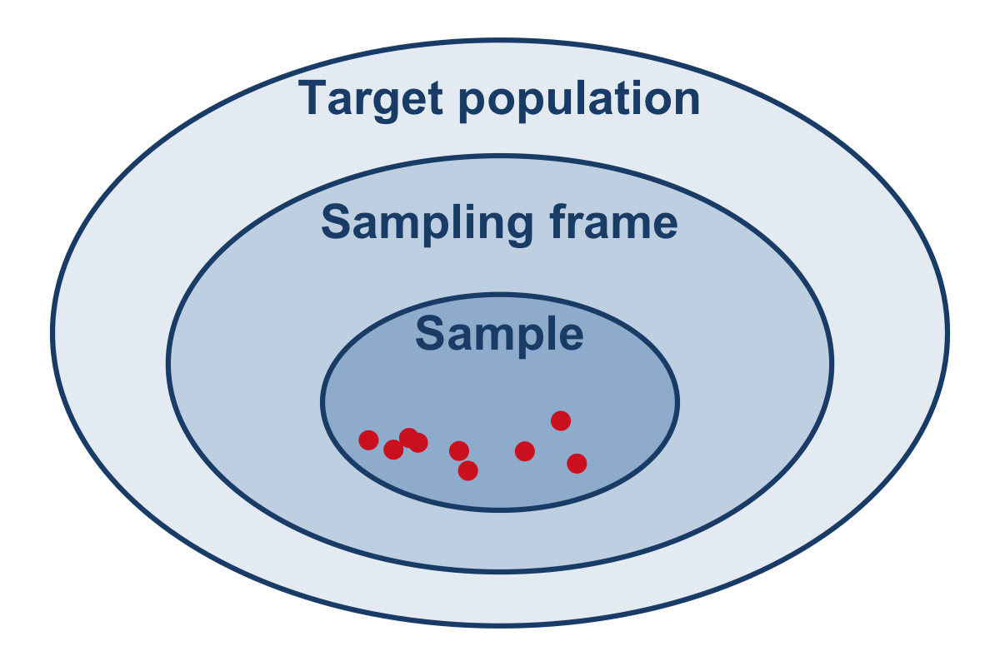
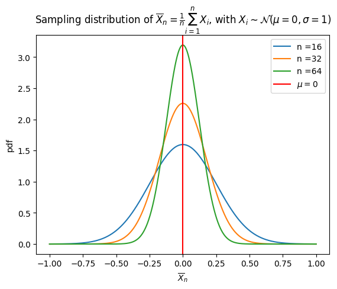
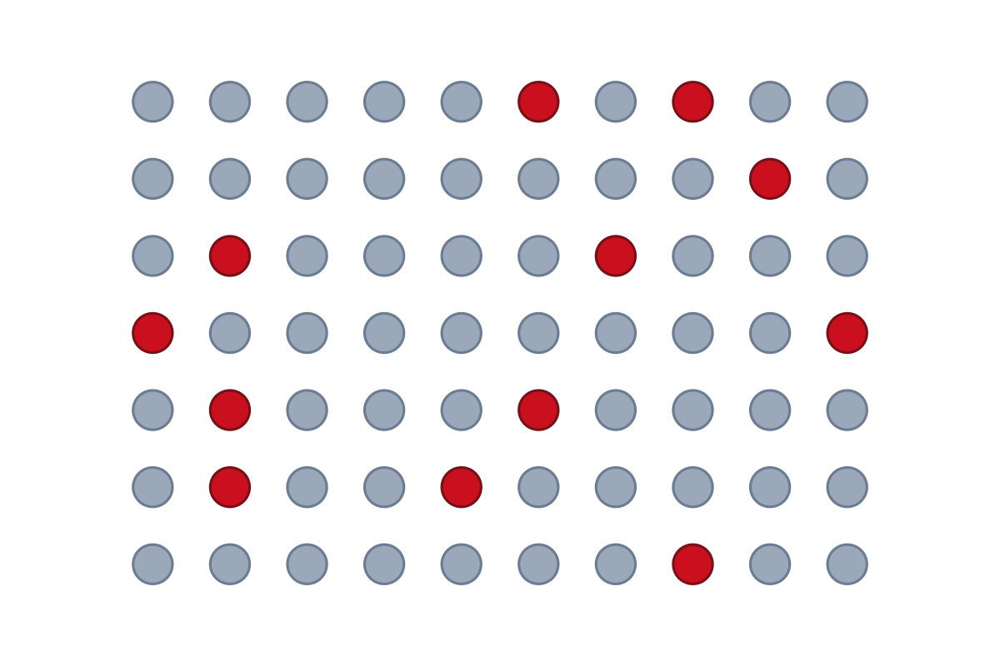
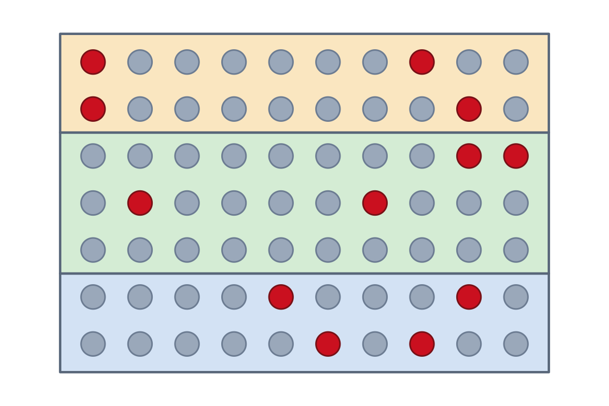
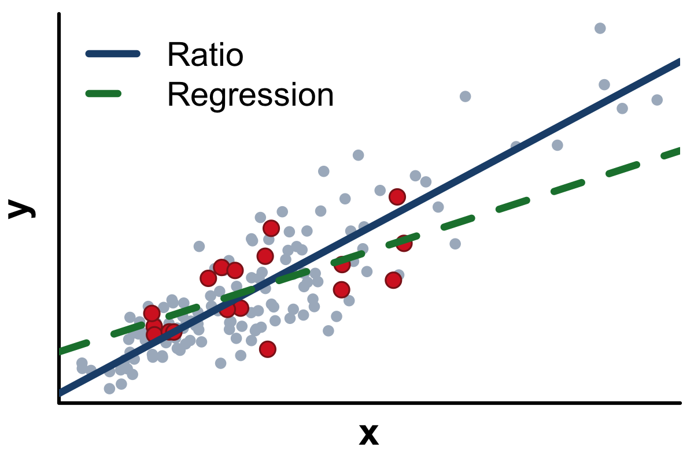
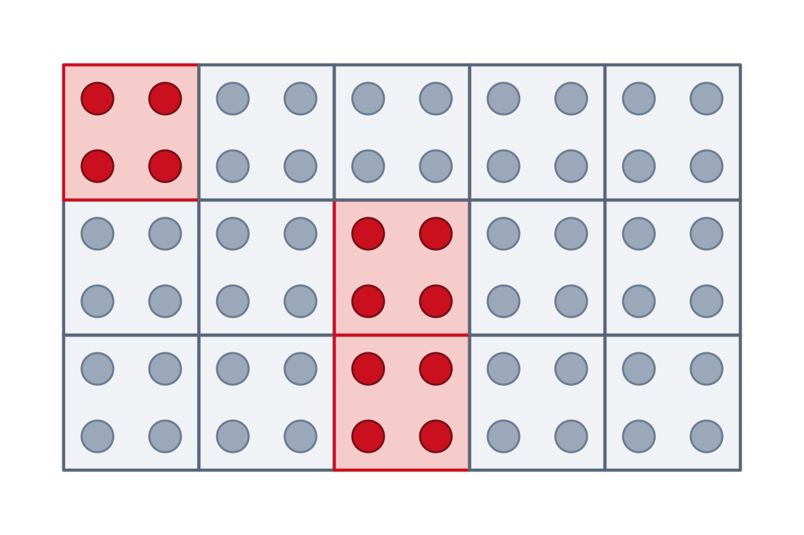
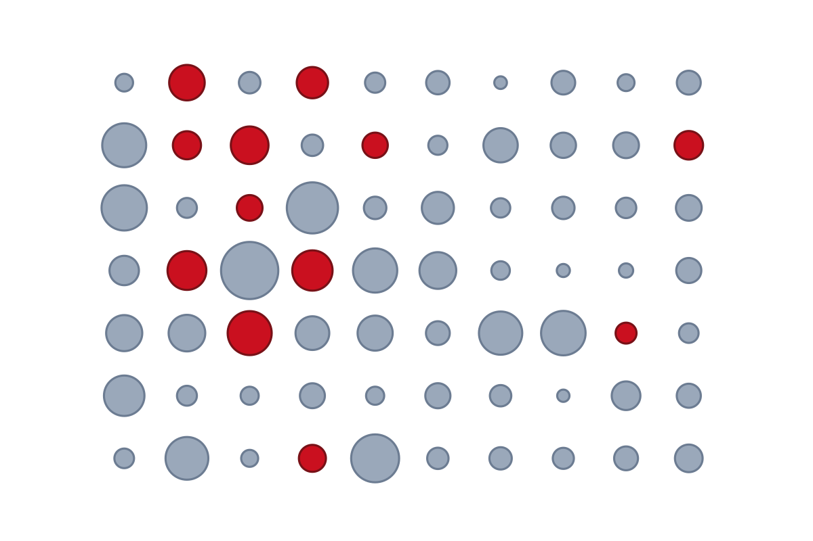

### Table of Content

<table class="toc">
<tr>
<td><a href="Lec01-sampling_survey.html">1. Introduction to Sampling Surveys</a></td>
<td><a href="Lec02-general_sampling.html">2. General Sampling Concepts</a></td>
<td><a href="Lec03-SRS.html">3. Simple Random Sampling (SRS)</a></td>
</tr>
<tr>
<td><a href="Lec04-strata.html">4. Stratified Sampling</a></td>
<td><a href="Lec05-ratio-reg.html">5. Ratio and Regression Estimation</a></td>
<td><a href="Lec06-cluster.html">6. Cluster Sampling</a></td>
</tr>
<tr>
<td><a href="Lec07-ups.html">7. Unequal Probability Sampling</a></td>
<td></td>
<td></td>
</tr>
</table>

Image credits:
(2) Sampling distribution, Biggerj1, CC BY 4.0, from Wikimedia Commons;
(1) and (3)–(7) generated in R for this page.

